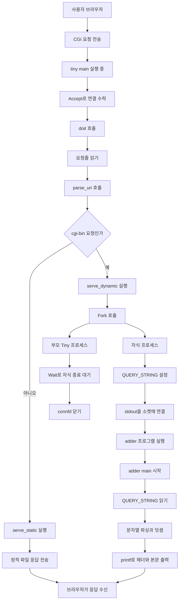
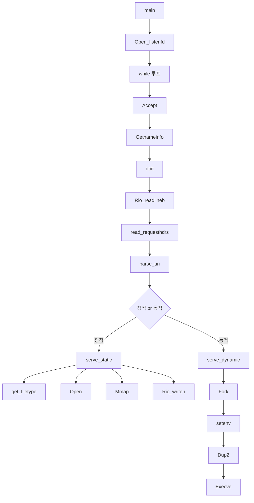
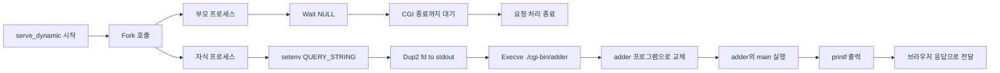
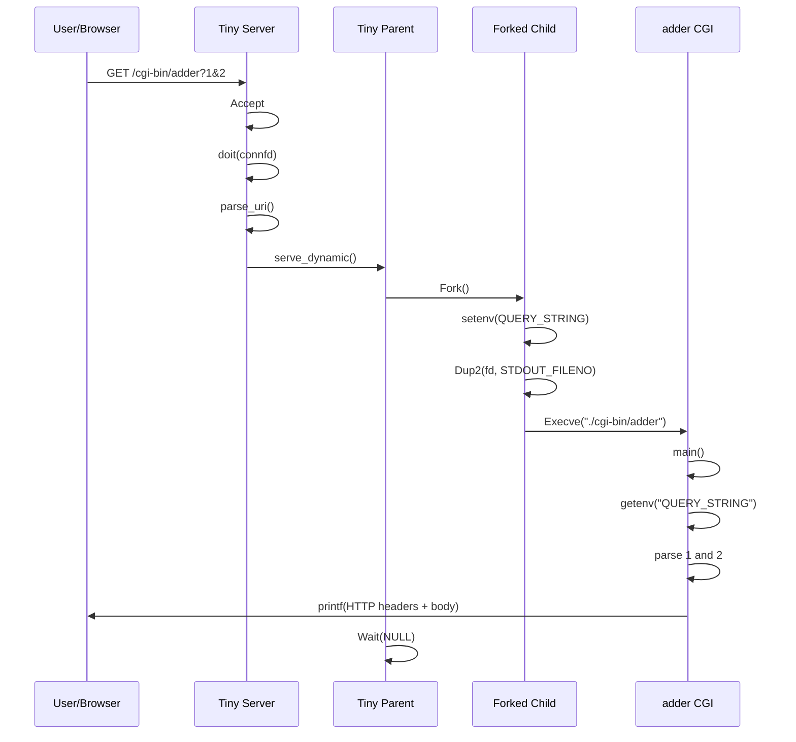
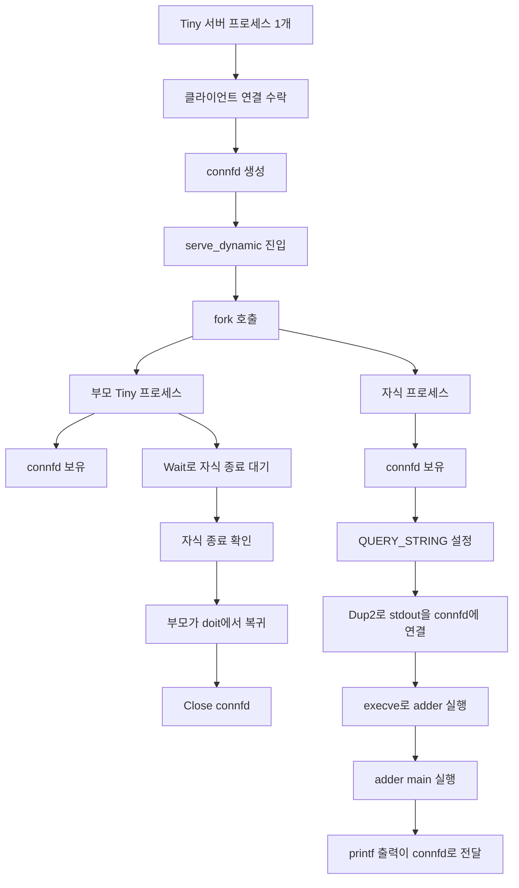
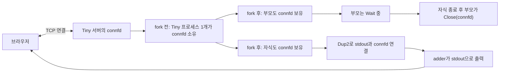
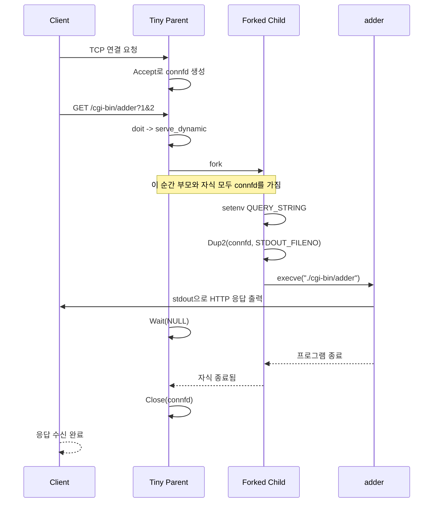
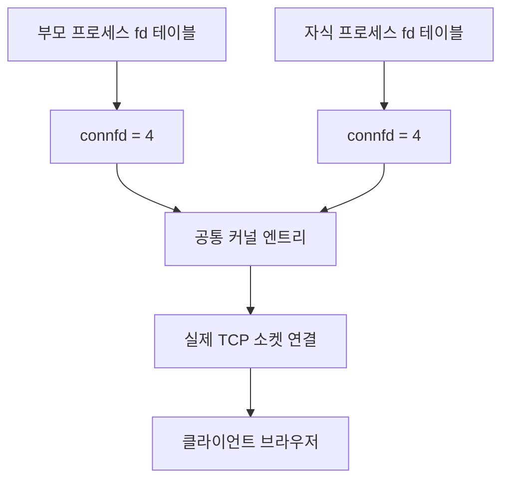
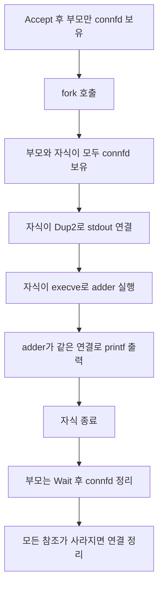
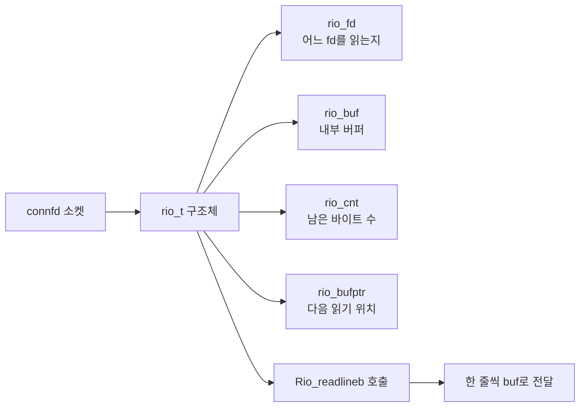

# Tiny CGI Flow Explanation

이 문서는 `webproxy-lab/tiny/tiny.c` 와 `webproxy-lab/tiny/cgi-bin/adder.c` 가
어떻게 함께 동작하는지 설명합니다.

특히 아래 질문에 답하는 것이 목표입니다.

1. 왜 `tiny.c`에도 `main()`이 있고 `adder.c`에도 `main()`이 있는가
2. 두 파일은 함수 호출 관계인가, 아니면 별도 프로그램 관계인가
3. 브라우저 요청이 들어왔을 때 어떤 순서로 코드가 실행되는가
4. `fork`, `execve`, `QUERY_STRING`, `Dup2`가 각각 무슨 역할을 하는가

## 1. 먼저 결론부터

`tiny.c`와 `adder.c`는 같은 프로그램 안의 함수 관계가 아닙니다.

둘은 서로 다른 실행 파일입니다.

- `tiny.c`
  - 웹 서버 프로그램 `tiny`를 만듭니다.
- `adder.c`
  - CGI 프로그램 `adder`를 만듭니다.

즉:

- `tiny`는 서버입니다.
- `adder`는 서버가 필요할 때 실행하는 별도 프로그램입니다.

그래서 두 파일 모두 `main()`이 있어도 전혀 이상하지 않습니다.

각 프로그램은 자기 자신만의 시작점이 필요하기 때문입니다.

## 2. 왜 `main()`이 두 개 있어도 괜찮은가

C에서는 "실행 파일 하나"마다 `main()`이 하나 필요합니다.

여기서 중요한 점은:

- `tiny.c`는 `tiny`라는 실행 파일로 빌드됩니다.
- `adder.c`는 `adder`라는 실행 파일로 빌드됩니다.

즉 서로 다른 바이너리이므로 각각 자기 `main()`을 가져도 됩니다.

예를 들어 이 디렉터리에서는 실제로 이렇게 나뉩니다.

- `tiny/Makefile`
  - `tiny.c`를 빌드해서 `tiny` 실행 파일을 만듭니다.
- `tiny/cgi-bin/Makefile`
  - `adder.c`를 빌드해서 `adder` 실행 파일을 만듭니다.

그래서:

- `tiny` 실행 시 시작점은 `tiny.c`의 `main()`
- `adder` 실행 시 시작점은 `adder.c`의 `main()`

입니다.

## 3. 두 파일의 관계를 아주 짧게 말하면

두 파일의 관계는 아래와 같습니다.

- `tiny.c`
  - HTTP 요청을 받는 서버 프로그램
- `adder.c`
  - 특정 URI 요청이 들어왔을 때 Tiny가 실행하는 CGI 프로그램

즉:

- `tiny.c`가 `adder.c` 안의 함수를 직접 호출하는 것이 아닙니다.
- `tiny.c`가 운영체제에게 "`adder`라는 다른 프로그램을 실행해라"라고 요청하는 구조입니다.

이 차이가 아주 중요합니다.

## 4. 전체 흐름 한눈에 보기

브라우저에서 아래 URL을 요청한다고 가정하겠습니다.

```text
http://localhost:8000/cgi-bin/adder?1&2
```

이 요청이 들어오면 큰 흐름은 아래와 같습니다.

1. 브라우저가 Tiny 서버에 요청을 보냅니다.
2. `tiny`가 요청줄을 읽습니다.
3. URI에 `cgi-bin`이 있으므로 동적 콘텐츠 요청이라고 판단합니다.
4. `tiny`가 자식 프로세스를 만듭니다.
5. 그 자식 프로세스에서 `adder` 실행 파일을 실행합니다.
6. `adder`의 `main()`이 시작됩니다.
7. `adder`가 `QUERY_STRING`에서 `1&2`를 읽습니다.
8. `adder`가 계산 결과를 표준 출력으로 출력합니다.
9. 그 출력이 브라우저 응답으로 전달됩니다.

## 4-1. 전체 워크플로우 그래프

아래 그래프는 브라우저, Tiny 서버, 부모 프로세스, 포크된 자식 프로세스,
그리고 `adder` CGI 프로그램이 어떻게 이어지는지 전체 흐름을 보여 줍니다.



## 4-2. 함수 중심 워크플로우 그래프

이번에는 Tiny 서버 쪽 함수가 어떤 순서로 이어지는지 함수 이름 중심으로 그리면 아래와 같습니다.



## 4-3. 부모 서버와 자식 프로세스 분기 그래프

`serve_dynamic()` 안에서는 특히 부모와 자식이 어떻게 역할을 나누는지 보는 것이 중요합니다.



## 4-4. 클라이언트와 서버 사이의 시퀀스 그래프

브라우저와 Tiny, 그리고 CGI 프로그램 사이의 왕복 흐름을 시퀀스 형태로 보면 아래와 같습니다.



## 4-5. 포크 직후 부모 서버와 자식 프로세스 분리 그래프

많이 헷갈리는 지점이라, `fork()`가 호출되는 순간을 중심으로 다시 그리면 아래와 같습니다.

핵심은:

- 원래는 Tiny 서버 프로세스 1개가 있음
- `Accept` 후 클라이언트와 연결된 `connfd`를 갖고 있음
- `fork()`가 되면 부모와 자식이 둘 다 같은 `connfd`를 가진 상태로 갈라짐
- 그 다음 자식은 `execve`로 `adder` 프로그램이 되고
- 부모는 `Wait`로 자식이 끝나길 기다림



## 4-6. 연결이 어떻게 이어지는지 보는 소켓 중심 그래프

이 그래프는 "누가 어떤 소켓을 들고 있는가"에만 집중해서 본 것입니다.



## 4-7. 연결 생성부터 종료까지 타임라인 그래프

아래는 연결이 만들어지고, 공유되고, 마지막에 닫히는 과정을 시간 순서대로 본 그래프입니다.



## 4-8. 여기서 중요한 연결 해석

위 그래프들을 볼 때 가장 중요하게 이해할 점은 아래와 같습니다.

1. `fork()` 직후 부모와 자식은 같은 연결의 파일 디스크립터를 각각 가지게 됩니다.
   - 즉, `connfd`라는 숫자가 논리적으로 같은 TCP 연결을 가리킵니다.

2. 자식이 `Dup2(connfd, STDOUT_FILENO)`를 하면,
   - 자식 프로세스에서 `printf`로 표준 출력에 쓰는 내용이
   - 결국 클라이언트와 연결된 소켓으로 나갑니다.

3. 자식이 `execve`를 해도 연결은 이어집니다.
   - 프로그램 코드는 `adder`로 바뀌지만
   - 열린 파일 디스크립터는 그대로 유지되기 때문입니다.

4. 부모는 직접 응답 본문을 만들지 않고 기다립니다.
   - 실제 응답 본문은 자식 쪽 `adder`가 출력합니다.

5. 마지막에는 부모가 `Close(connfd)`를 해서 현재 요청용 연결을 정리합니다.
   - 리스닝 소켓 `listenfd`는 닫지 않으므로 서버는 계속 살아 있습니다.

## 4-9. `connfd`를 더 정확히 이해하기

여기서 많이 헷갈리는 이유는
우리가 코드에서는 그냥 `int connfd` 하나만 보기 때문입니다.

하지만 운영체제 내부에서는 보통 아래처럼 층이 나뉘어 있다고 이해하면 편합니다.

1. 파일 디스크립터 번호
2. 열린 파일 설명 open file description 비슷한 커널 객체
3. 실제 소켓 또는 연결 상태를 담는 커널 객체

즉, 코드에서 보이는 `connfd`는 단순한 정수 번호이고,
그 정수 번호 뒤에는 운영체제 내부 자료구조가 더 있습니다.

### 아주 단순화한 해석

- `connfd`
  - 프로세스가 들고 있는 "번호표"
- 그 번호가 가리키는 커널 엔트리
  - 현재 열린 연결에 대한 공통 상태
- 그 아래 소켓 연결 상태
  - 실제 TCP 연결

그래서 `fork()` 뒤에 부모와 자식이 각각 `connfd`를 가진다는 말은,
"같은 TCP 연결을 가리키는 번호표를 각각 하나씩 들고 있다"라고 이해하면 좋습니다.

## 4-10. 파일 디스크립터와 커널 객체 관계 그래프



이 그림에서 중요한 점:

- 부모의 `connfd`와 자식의 `connfd`는 둘 다 정수 번호입니다
- 번호값이 우연히 둘 다 `4`처럼 같을 수도 있습니다
- 중요한 것은 "같은 커널 쪽 연결 객체를 참조한다"는 점입니다

## 4-11. 그래서 레퍼런스 카운트가 2라고 봐도 되는가

학습 관점에서는 거의 맞습니다.

`fork()` 직후에는:

- 부모 프로세스가 `connfd`를 하나 들고 있고
- 자식 프로세스도 `connfd`를 하나 들고 있으므로
- 같은 열린 연결을 참조하는 손잡이가 2개가 된 상태

라고 이해해도 됩니다.

즉, 개념적으로는 "참조 수가 2가 되었다"라고 보면 됩니다.

정확히 더 엄밀하게 말하면:

- 프로세스별 파일 디스크립터 엔트리가 2개 존재하고
- 둘 다 같은 커널 쪽 열린 연결 상태를 참조합니다

하지만 지금 단계에서는
"부모 1개 + 자식 1개 = 같은 연결을 가리키는 참조가 2개"
라고 이해하는 것이 가장 실용적입니다.

## 4-12. 연결이 왜 바로 안 끊기는가

이것도 레퍼런스 관점으로 보면 이해가 쉽습니다.

예를 들어 `fork()` 직후를 생각해 보면:

- 부모도 `connfd`를 가지고 있음
- 자식도 `connfd`를 가지고 있음

그러면 둘 중 하나만 닫혀서는 연결이 바로 완전히 없어지지 않습니다.

왜냐하면 다른 쪽에서 아직 같은 연결을 참조하고 있기 때문입니다.

즉:

- 자식이 종료되어 자식 쪽 fd가 정리되어도
- 부모가 아직 `connfd`를 가지고 있으면 연결은 부모 쪽에서 여전히 열려 있다고 볼 수 있습니다

반대로:

- 부모가 먼저 닫아도
- 자식이 아직 열고 있으면 자식은 그 연결로 계속 쓸 수 있습니다

결국 완전히 정리되려면 그 연결을 참조하는 모든 fd가 닫혀야 합니다.

## 4-13. `execve()`를 해도 왜 연결이 유지되는가

이 부분도 아주 중요합니다.

`execve()`는 "프로그램 코드"를 바꾸는 것이지,
기본적으로 열린 파일 디스크립터를 자동으로 다 닫는 것은 아닙니다.

그래서 자식 프로세스는:

1. `fork()` 직후 `connfd`를 가짐
2. `Dup2(connfd, STDOUT_FILENO)`로 표준 출력도 그 연결에 연결함
3. `execve("./cgi-bin/adder", ...)` 실행
4. 이제 코드는 `adder`로 바뀌었지만 fd는 살아 있음

그래서 `adder`의 `printf()` 출력이 계속 같은 연결로 나갈 수 있습니다.

즉:

- 프로그램은 바뀌었지만
- 연결 손잡이는 유지된 것

입니다.

## 4-14. 시간 순서대로 다시 보면



## 4-15. 한 문장으로 정리

`fork()` 뒤에는 부모와 자식이 같은 TCP 연결을 가리키는 파일 디스크립터를 각각 하나씩 가지므로,
학습 관점에서는 "레퍼런스가 2개인 상태"라고 이해해도 거의 맞습니다.

## 4-16. `stdout`과 `STDOUT_FILENO`를 헷갈리지 않기

여기서 또 자주 헷갈리는 포인트가 있습니다.

`STDOUT_FILENO`는 "소켓 주소" 같은 것이 아닙니다.

`STDOUT_FILENO`는 그냥 표준 출력에 해당하는 파일 디스크립터 번호 상수이고,
값은 `1`입니다.

즉:

- `STDIN_FILENO` = 0
- `STDOUT_FILENO` = 1
- `STDERR_FILENO` = 2

여기서 중요한 것은
"`STDOUT_FILENO` 값 자체가 바뀌는가?"가 아니라
"1번 fd가 어떤 대상을 가리키는가?"입니다.

### `dup2(fd, STDOUT_FILENO)`를 정확히 읽는 법

이 코드는:

- `fd`가 가리키는 대상을
- `STDOUT_FILENO`, 즉 1번 fd도 보게 만들어라

는 뜻입니다.

즉 바뀌는 것은:

- `stdout`이 쓰는 통로인 1번 fd의 연결 대상

입니다.

### 바꾸기 전

```text
stdout -> fd 1 -> 터미널
connfd -> fd 4 -> 클라이언트 소켓
```

### `dup2(connfd, STDOUT_FILENO)` 후

```text
stdout -> fd 1 -> 클라이언트 소켓
connfd -> fd 4 -> 클라이언트 소켓
```

즉:

- `STDOUT_FILENO`가 1이 아닌 다른 값으로 바뀐 것이 아닙니다
- 여전히 `STDOUT_FILENO`는 1입니다
- 대신 1번 fd가 터미널 대신 소켓을 가리키게 됩니다

그래서 이후 `printf()`는 여전히 `stdout`에 출력하지만,
그 `stdout`의 도착지가 터미널이 아니라 브라우저와 연결된 소켓이 됩니다.

## 4-17. 가장 짧은 정리

`dup2(connfd, STDOUT_FILENO)`는
"표준 출력 번호를 바꾸는 것"이 아니라
"표준 출력 번호 1이 가리키는 대상을 소켓으로 갈아끼우는 것"입니다.

## 4-18. `Rio_read*`와 `Rio_writen`도 같이 이해하기

여기까지 오면 보통 다음 질문이 자연스럽게 나옵니다.

- Tiny는 요청을 어떻게 읽는가
- Tiny는 응답을 어떻게 보내는가
- `read`, `write` 대신 왜 `Rio_*`를 쓰는가

이때 등장하는 것이 CS:APP의 Robust I/O, 즉 `Rio_*` 함수들입니다.

아주 짧게 요약하면:

- `Rio_readlineb`
  - 소켓에서 한 줄씩 읽기 좋게 만든 함수
- `Rio_readnb`
  - 소켓에서 n바이트를 읽기 좋게 만든 함수
- `Rio_writen`
  - 지정한 바이트 수를 끝까지 보내도록 도와주는 함수

즉, Tiny는 소켓을 직접 만지더라도
읽기와 쓰기를 좀 더 안전하고 편하게 하기 위해 `Rio_*`를 사용합니다.

## 4-19. `Rio_readlineb`는 무엇을 하나

Tiny에서 요청을 읽을 때 제일 자주 보이는 것은 `Rio_readlineb`입니다.

예를 들면:

```c
Rio_readlineb(&rio, buf, MAXLINE);
```

뜻은:

- `rio`라는 읽기 도구를 사용해서
- 현재 연결된 소켓에서
- 한 줄을 읽어
- `buf`에 넣어라

입니다.

HTTP 요청은 보통 줄 단위로 구성되기 때문에 이 함수가 잘 맞습니다.

예:

```text
GET /cgi-bin/adder?1&2 HTTP/1.1
Host: 127.0.0.1:8000
User-Agent: curl/8.5.0
Accept: */*

```

Tiny는 이런 요청을 줄 단위로 읽어야 하므로 `Rio_readlineb`를 사용합니다.

## 4-20. `Rio_read`라는 말은 보통 무엇을 가리키는가

질문에서 말한 `Rio_read`는 보통 아래 둘 중 하나를 헷갈린 경우가 많습니다.

1. 내부 구현 함수 `rio_read`
2. 실제 코드에서 자주 보이는 `Rio_readlineb`, `Rio_readnb`

Tiny 같은 코드에서 우리가 직접 신경 써야 하는 것은 주로:

- `Rio_readinitb`
- `Rio_readlineb`
- `Rio_readnb`

입니다.

### `Rio_readinitb`

```c
Rio_readinitb(&rio, fd);
```

뜻:

- `rio`라는 읽기 구조체를
- `fd` 소켓에 연결해서
- 이제 이 `rio`로부터 읽게 준비해라

즉, 읽기 도구를 특정 소켓과 연결하는 초기화 단계입니다.

### `Rio_readlineb`

```c
Rio_readlineb(&rio, buf, MAXLINE);
```

뜻:

- 이 소켓에서 한 줄 읽어라

HTTP 요청줄, 헤더를 읽을 때 잘 맞습니다.

### `Rio_readnb`

```c
Rio_readnb(&rio, buf, n);
```

뜻:

- 이 소켓에서 최대 `n`바이트를 읽어라

정적 파일 본문이나 줄 단위가 아닌 데이터를 다룰 때 떠올릴 수 있는 함수입니다.

## 4-21. `Rio_writen`은 무엇을 하나

응답을 클라이언트에게 보낼 때는 `Rio_writen`이 자주 나옵니다.

예:

```c
Rio_writen(fd, buf, strlen(buf));
```

뜻은:

- `fd`가 가리키는 소켓으로
- `buf` 안의 데이터를
- `strlen(buf)` 바이트만큼 보내라

입니다.

즉, Tiny가 만든 HTTP 응답 헤더나 본문을 실제로 브라우저 쪽으로 보내는 함수입니다.

## 4-22. 왜 그냥 `read`와 `write`를 안 쓰는가

소켓에서는 `read`나 `write`를 한 번 호출했다고 해서
항상 내가 원하는 길이만큼 정확히 처리된다는 보장이 약합니다.

예를 들면:

- 일부만 읽힐 수 있음
- 일부만 써질 수 있음
- 인터럽트 등으로 중간에 끊길 수 있음

`Rio_*` 함수는 이런 점을 조금 더 다루기 쉽게 감싸서,
학습용 코드에서 흐름을 더 명확하게 보여 줍니다.

그래서:

- Tiny는 요청 읽기에 `Rio_readlineb`
- 응답 쓰기에 `Rio_writen`

을 사용합니다.

## 4-23. Tiny 안에서 실제로 어디에 쓰이는가

### 요청 읽기

Tiny는 `doit()` 안에서:

```c
Rio_readinitb(&rio, fd);
Rio_readlineb(&rio, buf, MAXLINE);
```

를 통해 요청 첫 줄을 읽습니다.

그리고 `read_requesthdrs()` 안에서는
헤더를 계속 `Rio_readlineb`로 읽습니다.

즉:

- 브라우저 -> Tiny 요청 전달
- Tiny -> `Rio_readlineb`로 한 줄씩 읽음

입니다.

### 응답 쓰기

Tiny는 `clienterror()`, `serve_static()`, `serve_dynamic()` 등에서
`Rio_writen`으로 응답을 보냅니다.

예:

```c
Rio_writen(fd, buf, strlen(buf));
```

즉:

- Tiny가 응답 문자열 생성
- `Rio_writen`이 그 문자열을 소켓으로 보냄
- 브라우저가 그 응답을 받음

입니다.

## 4-24. 읽기와 쓰기 흐름 그래프


## 4-25. 비유로 보면

- `Rio_readlineb`
  - 빨대로 한 줄씩 또박또박 읽는 도구
- `Rio_writen`
  - 편지를 끝까지 다 봉투에 넣어 보내는 도구

즉:

- `Rio_readlineb`는 "읽기 편하게 줄 단위로"
- `Rio_writen`은 "보내야 할 만큼 끝까지"

도와주는 함수라고 생각하면 됩니다.

## 4-26. 한 문장으로 정리

Tiny에서 `Rio_readlineb`는 브라우저의 HTTP 요청을 소켓에서 읽는 도구이고,
`Rio_writen`은 Tiny가 만든 HTTP 응답을 소켓으로 끝까지 보내는 도구입니다.

## 4-27. 그럼 `rio` 구조체는 왜 필요한가

여기까지 보면 또 이런 의문이 생깁니다.

- 왜 `Rio_readlineb(&rio, buf, MAXLINE)`처럼 `rio`를 넘기지?
- 그냥 `read(fd, buf, ...)`처럼 읽으면 안 되나?

이 질문의 답이 `rio_t` 구조체입니다.

`rio_t`는 "현재 이 소켓에서 읽기가 어디까지 진행되었는지"를 기억하기 위한 상태 묶음입니다.

즉:

- 어떤 fd에서 읽고 있는지
- 내부 버퍼에 아직 읽지 않은 데이터가 얼마나 남았는지
- 다음에는 내부 버퍼의 어디서부터 읽어야 하는지

를 저장합니다.

## 4-28. `rio_t` 안에는 무엇이 들어 있나

`csapp.h` 안의 `rio_t`는 대략 이런 의미를 가집니다.

```c
typedef struct {
    int rio_fd;
    int rio_cnt;
    char *rio_bufptr;
    char rio_buf[RIO_BUFSIZE];
} rio_t;
```

각 필드의 뜻을 쉽게 풀면:

- `rio_fd`
  - 지금 어떤 파일 디스크립터에서 읽고 있는가
- `rio_cnt`
  - 내부 버퍼에 아직 안 읽은 바이트가 몇 개 남았는가
- `rio_bufptr`
  - 다음에 읽을 위치가 어디인가
- `rio_buf`
  - 실제로 읽어 둔 데이터를 잠시 저장하는 내부 버퍼

즉 `rio_t`는 단순한 문자 배열이 아니라
"읽기 진행 상태를 기억하는 메모장" 같은 구조체입니다.

## 4-29. 왜 이런 구조체가 있어야 하나

HTTP 요청은 보통 한 줄씩 읽고 싶습니다.

예:

```text
GET / HTTP/1.1
Host: 127.0.0.1:8000
User-Agent: curl/8.5.0
Accept: */*
```

그런데 운영체제의 `read()`는
"한 줄" 개념을 자동으로 보장해 주지 않습니다.

예를 들어 한 번 읽었더니:

- 첫 줄 전체가 올 수도 있고
- 첫 줄 일부만 올 수도 있고
- 첫 줄과 다음 줄 일부가 같이 올 수도 있습니다

그러므로 "줄 단위로 안정적으로 읽기"를 하려면
중간 상태를 어디엔가 저장해 둬야 합니다.

바로 그 역할을 `rio_t`가 합니다.

## 4-30. `Rio_readinitb`가 하는 일

```c
Rio_readinitb(&rio, fd);
```

이 함수는:

- `rio` 구조체를
- 특정 fd와 연결하고
- 내부 읽기 상태를 초기화합니다

쉽게 말하면:

"앞으로 이 `rio`는 이 소켓에서 읽어라"

라고 설정하는 단계입니다.

그래서 그 다음부터:

```c
Rio_readlineb(&rio, buf, MAXLINE);
```

처럼 같은 `rio`를 계속 넘기면,
이전 읽기 상태를 이어서 사용할 수 있습니다.

## 4-31. 그림으로 보면



## 4-32. `buf`만으로는 부족한 이유

`buf`는 "이번에 사용자에게 넘겨줄 결과 문자열"을 담는 공간입니다.

하지만 `rio_t`는 그보다 더 많은 것을 관리합니다.

예를 들어:

- 이미 소켓에서 100바이트를 읽어 왔는데
- 그중 30바이트만 이번 줄 읽기에 썼고
- 나머지 70바이트는 다음 줄 읽기에 써야 할 수 있습니다

그 남은 70바이트를 어디엔가 기억해야 하죠.

그 역할이 바로 `rio_t`입니다.

즉:

- `buf`
  - 이번에 바깥으로 꺼내 줄 결과
- `rio_t`
  - 그 결과를 만들기 위해 내부적으로 관리하는 읽기 상태

입니다.

## 4-33. Tiny에서 실제 흐름

Tiny는 대략 이렇게 동작합니다.

1. `Rio_readinitb(&rio, fd)`
   - 이 연결을 읽을 준비
2. `Rio_readlineb(&rio, buf, MAXLINE)`
   - 요청줄 한 줄 읽기
3. `Rio_readlineb(&rio, buf, MAXLINE)`
   - 헤더 한 줄 읽기
4. `Rio_readlineb(&rio, buf, MAXLINE)`
   - 다음 헤더 한 줄 읽기

이때 매번 `&rio`를 넘기는 이유는
앞에서 읽은 상태를 이어서 써야 하기 때문입니다.

## 4-34. 비유로 보면

- `buf`
  - 지금 손에 들고 읽는 종이 한 장
- `rio_t`
  - 책갈피, 메모, 남은 페이지 위치까지 기록하는 읽기 도구

즉 `buf`만 있으면 현재 줄만 들고 있을 수는 있지만,
다음 줄을 어디서부터 읽어야 하는지는 기억하기 어렵습니다.

## 4-35. 한 문장으로 정리

`rio_t`는 소켓에서 한 줄씩 안정적으로 읽기 위해
"어디까지 읽었는지"를 기억하는 내부 상태 구조체입니다.

## 5. 코드 기준으로 실제 흐름 따라가기

### 5-1. 서버 시작

먼저 사용자가 Tiny 서버를 실행합니다.

```bash
./tiny 8000
```

그러면 [tiny.c](/home/leeminjeong/workspace/python_project/jungle/data_structures_docker/webproxy-lab/tiny/tiny.c:30) 의 `main()`이 시작됩니다.

이 `main()`의 역할:

- 포트를 열고
- 클라이언트 연결을 기다리고
- 연결이 오면 요청 하나를 처리하는 것

즉, 이 `main()`은 "웹 서버 프로그램의 시작점"입니다.

### 5-2. 요청 수락

브라우저가 `/cgi-bin/adder?1&2` 요청을 보내면 Tiny는 연결을 받아들입니다.

핵심 코드는 [tiny.c](/home/leeminjeong/workspace/python_project/jungle/data_structures_docker/webproxy-lab/tiny/tiny.c:48) 근처입니다.

```c
connfd = Accept(listenfd, (SA *)&clientaddr, &clientlen);
doit(connfd);
```

여기서 의미는:

- `Accept(...)`
  - 브라우저와 연결된 소켓을 하나 만든다
- `doit(connfd)`
  - 그 연결에서 HTTP 요청 1개를 처리한다

### 5-3. 요청줄 읽기

[tiny.c](/home/leeminjeong/workspace/python_project/jungle/data_structures_docker/webproxy-lab/tiny/tiny.c:92) 의 `doit()`는 요청의 첫 줄을 읽습니다.

예를 들면 이런 줄입니다.

```text
GET /cgi-bin/adder?1&2 HTTP/1.0
```

그리고 이 줄을 분해해서:

- method = `GET`
- uri = `/cgi-bin/adder?1&2`
- version = `HTTP/1.0`

로 저장합니다.

### 5-4. 정적 요청인지 동적 요청인지 구분

그 다음 [tiny.c](/home/leeminjeong/workspace/python_project/jungle/data_structures_docker/webproxy-lab/tiny/tiny.c:111) 의 `parse_uri()`가 호출됩니다.

이 함수는 URI 안에 `cgi-bin`이 있는지 검사합니다.

- `cgi-bin`이 없으면 정적 콘텐츠
- `cgi-bin`이 있으면 동적 콘텐츠

지금은 URI가 `/cgi-bin/adder?1&2` 이므로 동적 콘텐츠입니다.

그래서:

- 실행 파일 경로: `./cgi-bin/adder`
- CGI 인자 문자열: `1&2`

로 나뉘게 됩니다.

## 6. `serve_dynamic()`에서 진짜 중요한 일

동적 요청이면 [tiny.c](/home/leeminjeong/workspace/python_project/jungle/data_structures_docker/webproxy-lab/tiny/tiny.c:389) 의 `serve_dynamic()`이 호출됩니다.

여기가 핵심입니다.

```c
if(Fork() == 0){
    setenv("QUERY_STRING", cgiargs, 1);
    Dup2(fd, STDOUT_FILENO);
    Execve(filename, emptylist, environ);
}
Wait(NULL);
```

이 네 줄이 CGI의 핵심입니다.

### 6-1. `Fork()`

`Fork()`는 현재 프로세스를 복제해서 자식 프로세스를 만듭니다.

왜 자식을 만들까?

이유는 Tiny 서버 본체와 CGI 프로그램 실행을 분리하기 위해서입니다.

부모 프로세스:

- 여전히 Tiny 서버 역할을 유지

자식 프로세스:

- 이제 CGI 프로그램을 실행할 준비를 함

즉, 웹 서버가 자기 몸을 완전히 `adder`로 바꾸는 것이 아니라,
"자식 하나를 만들어 그 자식에게 CGI를 맡긴다"라고 생각하면 됩니다.

### 6-2. `setenv("QUERY_STRING", cgiargs, 1)`

이 줄은 CGI 프로그램이 사용할 입력 값을 환경변수로 넣어 주는 작업입니다.

현재 예시에서는:

- `cgiargs = "1&2"`

이므로 결과적으로 자식 프로세스 환경에:

```text
QUERY_STRING=1&2
```

가 들어갑니다.

왜 이렇게 하냐면, 전통적인 CGI 프로그램은 URL 뒤의 쿼리 문자열을
`QUERY_STRING` 환경변수로 전달받기 때문입니다.

즉, Tiny는 `adder`에게 직접 함수 인자로 `1`, `2`를 넘기는 것이 아니라,
운영체제 환경변수 형태로 넘깁니다.

### 6-3. `Dup2(fd, STDOUT_FILENO)`

이 줄도 매우 중요합니다.

뜻은:

- 현재 클라이언트 소켓 `fd`를
- 표준 출력 `STDOUT_FILENO`로 연결한다

는 것입니다.

쉽게 말하면:

"이제부터 CGI 프로그램이 `printf`로 화면에 출력한다고 생각하는 모든 내용은
실제로는 브라우저에게 보내라"

는 뜻입니다.

그래서 `adder.c` 안에서 `printf(...)`를 하면,
그 출력이 터미널이 아니라 브라우저 응답으로 갑니다.

### 6-4. `Execve(filename, emptylist, environ)`

이 줄이 진짜로 `adder` 프로그램을 실행하는 부분입니다.

여기서 `filename`은 보통:

```text
./cgi-bin/adder
```

입니다.

`Execve`가 호출되면 자식 프로세스의 현재 실행 코드는 사라지고,
그 자리에 `adder` 실행 파일이 로드됩니다.

즉, 이 순간부터 자식 프로세스는 Tiny 코드가 아니라
`adder` 프로그램 자체가 됩니다.

그리고 그 프로그램의 시작점인 `main()`이 실행됩니다.

바로 이 때문에 `adder.c`에 `main()`이 필요한 것입니다.

## 7. 그래서 `adder.c`의 `main()`은 언제 실행되는가

정답은:

- 사용자가 `adder.c`를 직접 함수 호출할 때가 아니라
- Tiny가 `Execve("./cgi-bin/adder", ...)`를 했을 때

입니다.

즉, `adder.c`의 `main()`은 Tiny 안에서 직접 호출되는 것이 아니라
"새 프로그램이 시작되면서 자동으로 실행되는 진입점"입니다.

이걸 아주 짧게 쓰면:

- `tiny.c`의 `main()`은 서버 시작점
- `adder.c`의 `main()`은 CGI 프로그램 시작점

입니다.

## 8. `adder.c`는 그 안에서 무슨 일을 하나

[adder.c](/home/leeminjeong/workspace/python_project/jungle/data_structures_docker/webproxy-lab/tiny/cgi-bin/adder.c:8) 의 `main()`은 대략 이런 순서로 동작합니다.

1. `getenv("QUERY_STRING")`으로 쿼리 문자열을 읽는다
2. `&`를 기준으로 두 숫자를 분리한다
3. 문자열 `"1"`, `"2"`를 정수 `1`, `2`로 바꾼다
4. 계산 결과를 HTML 본문 문자열로 만든다
5. `printf`로 HTTP 헤더와 본문을 출력한다

예를 들어:

```c
buf = getenv("QUERY_STRING");
```

를 호출하면 Tiny가 미리 넣어 둔:

```text
QUERY_STRING=1&2
```

에서 `"1&2"`를 읽게 됩니다.

그 다음:

```c
p = strchr(buf, '&');
*p = '\0';
```

를 통해 원래 `"1&2"`였던 문자열을 메모리에서:

- `"1"`
- `"2"`

처럼 쪼개서 사용합니다.

그리고 마지막에:

```c
printf("Content-type: text/html\r\n\r\n");
printf("%s", content);
```

를 실행하면 그 내용이 브라우저로 전달됩니다.

왜냐하면 Tiny가 이미 `Dup2(fd, STDOUT_FILENO)`를 해 두었기 때문입니다.

## 9. `printf`가 왜 브라우저로 가는가

초보자 입장에서는 이 부분이 가장 신기할 수 있습니다.

보통 `printf`는 터미널에 출력된다고 생각하기 쉽습니다.

그런데 CGI에서는 다릅니다.

Tiny가 `Dup2(fd, STDOUT_FILENO)`를 호출한 뒤에는
표준 출력이 더 이상 터미널이 아니라 "클라이언트와 연결된 소켓"이 됩니다.

그래서 `adder`가 표준 출력으로 내보낸 내용은:

- 터미널이 아니라
- 브라우저 응답으로 전송됩니다

즉:

- `adder`는 그냥 `printf`만 하고
- Tiny가 그 출력을 브라우저로 가게 길을 바꿔 둔 것

입니다.

## 10. 함수 호출 관계가 아닌 이유

많이 헷갈리는 지점이라 다시 분명히 적으면:

아래는 아닙니다.

```c
// 이런 구조가 아님
doit() -> serve_dynamic() -> adder_main()
```

실제 구조는 이쪽에 가깝습니다.

```text
tiny 프로그램 실행 중
  -> fork
  -> 자식 프로세스 생성
  -> execve("./cgi-bin/adder")
  -> adder 프로그램 시작
  -> adder의 main() 실행
```

즉:

- `adder.c`는 `tiny.c`에 링크된 함수 파일이 아니라
- 별도 실행 파일로 존재하는 프로그램입니다

## 11. 비유로 이해하기

비유하면 이렇게 볼 수 있습니다.

- `tiny`
  - 식당 점원
- `adder`
  - 주문 들어오면 따로 부르는 요리사

흐름은:

1. 손님이 주문함
2. 점원이 주문 내용을 확인함
3. "이건 요리사에게 맡겨야 하는 주문이네"라고 판단함
4. 요리사를 불러서 주문 내용을 전달함
5. 요리사가 결과물을 만들어 냄
6. 그 결과물이 손님에게 전달됨

여기서 중요한 점:

- 점원이 직접 요리를 하는 것이 아닙니다
- 요리사가 별도 역할을 맡고 있습니다

Tiny와 CGI 프로그램 관계도 이와 비슷합니다.

## 12. 이 구조의 장점

이 구조의 장점은 역할이 잘 분리된다는 것입니다.

- Tiny 서버
  - HTTP 요청 수락
  - 요청 종류 판별
  - 정적/동적 분기
  - CGI 실행 환경 준비

- CGI 프로그램
  - 자기 로직 실행
  - 필요한 계산 수행
  - 응답 본문 출력

즉, 서버는 "웹 요청 처리"에 집중하고,
CGI 프로그램은 "실제 작업"에 집중합니다.

## 13. 마지막 정리

이 디렉터리에서 `main()`이 두 개 있는 이유는
"서로 다른 실행 파일이 두 개 있기 때문"입니다.

정리하면:

1. `tiny.c`의 `main()`
   - 웹 서버 프로그램 `tiny`의 시작점
2. `adder.c`의 `main()`
   - CGI 프로그램 `adder`의 시작점
3. Tiny는 동적 요청이 오면 `fork` 후 `execve`로 `adder`를 실행한다
4. Tiny는 `QUERY_STRING` 환경변수로 입력을 넘긴다
5. Tiny는 `Dup2`로 `adder`의 표준 출력을 브라우저 응답으로 연결한다
6. 그래서 `adder`의 `printf` 결과가 브라우저로 간다

가장 짧게 한 문장으로 말하면:

`adder.c`는 Tiny 안의 함수 파일이 아니라, Tiny가 필요할 때 실행하는 별도 CGI 프로그램이다.`
