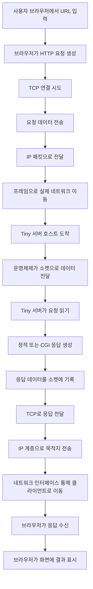
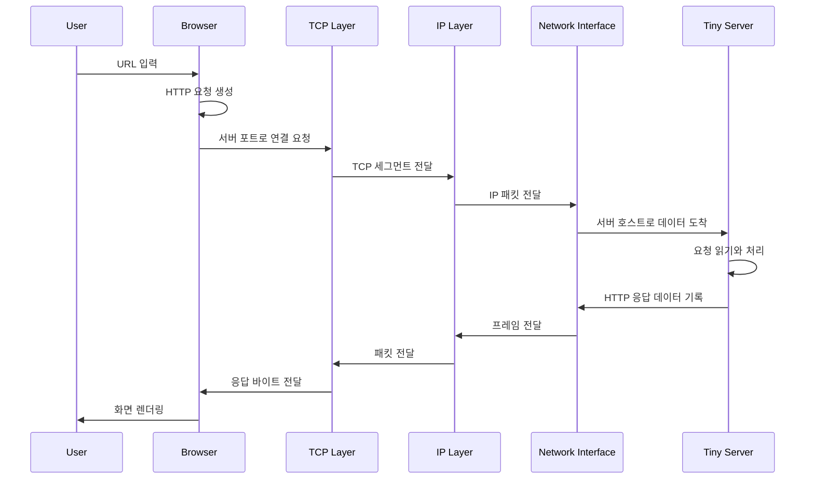
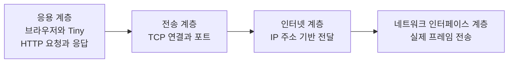
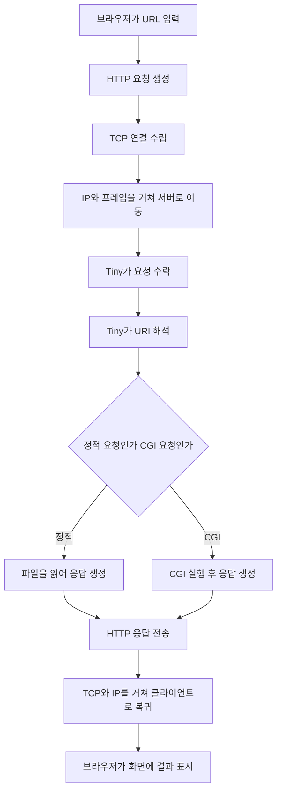

# Tiny Server and TCP/IP 4-Layer Flow

이 문서는 `webproxy-lab/tiny` 서버를 기준으로,
클라이언트가 요청을 보내고 결과를 화면으로 받기까지의 과정을
TCP/IP 4계층 관점에서 설명합니다.

이 문서의 목표는 아래 3가지입니다.

1. Tiny 서버 실습이 네트워크 4계층과 어떻게 연결되는지 이해하기
2. 브라우저와 서버 사이에서 데이터가 어떤 식으로 오가는지 큰 흐름 잡기
3. Tiny 내부 함수 설명이 아니라, "네트워크를 통해 요청과 응답이 이동하는 과정" 이해하기

참고:

- Tiny 내부 함수 흐름, `fork`, `execve`, CGI 실행 구조는
  [CGI_FLOW_EXPLANATION.md](/home/leeminjeong/workspace/python_project/jungle/data_structures_docker/webproxy-lab/CGI_FLOW_EXPLANATION.md)
  에서 더 자세히 설명합니다.
- 이 문서에서는 서버 내부 구현은 필요한 만큼만 언급합니다.

## 1. 먼저: 여기서 말하는 "4계층"은 무엇인가

보통 수업이나 실습에서 "4계층"이라고 하면
TCP/IP 4계층 모델을 말하는 경우가 많습니다.

여기서는 아래처럼 보겠습니다.

1. 응용 계층
2. 전송 계층
3. 인터넷 계층
4. 네트워크 인터페이스 계층

각 계층을 Tiny 실습에 맞춰 아주 짧게 요약하면:

- 응용 계층
  - 브라우저, Tiny 서버, HTTP 요청/응답
- 전송 계층
  - TCP 연결, 포트 번호, 데이터 전달
- 인터넷 계층
  - IP 주소를 기준으로 목적지까지 보내기
- 네트워크 인터페이스 계층
  - 실제 물리 네트워크를 통해 프레임 단위로 전달

## 2. Tiny 실습에서 각 계층이 맡는 역할

### 2-1. 응용 계층

응용 계층에서는 사람이 이해하는 수준의 요청과 응답이 오갑니다.

예:

```text
GET / HTTP/1.1
Host: 127.0.0.1:8000
```

또는:

```text
GET /cgi-bin/adder?1&2 HTTP/1.1
Host: 127.0.0.1:8000
```

여기서 Tiny 서버는:

- 요청줄을 읽고
- URI를 해석하고
- 정적 파일 또는 CGI 응답을 결정하고
- HTTP 응답을 만듭니다

즉, Tiny가 직접 다루는 핵심은 응용 계층의 HTTP입니다.

### 2-2. 전송 계층

전송 계층에서는 TCP가 등장합니다.

이 계층의 핵심은:

- 연결을 맺는다
- 포트 번호를 구분한다
- 데이터를 순서대로, 빠짐없이 전달하려고 한다

Tiny 실습에서는:

- 서버는 `8000` 같은 포트에서 기다립니다
- 클라이언트는 그 포트로 TCP 연결을 시도합니다
- 연결이 성공하면 소켓을 통해 데이터를 읽고 씁니다

즉, Tiny의 `listenfd`, `connfd`, 클라이언트의 소켓은
전송 계층의 TCP 연결을 프로그램이 사용하기 위한 창구입니다.

### 2-3. 인터넷 계층

인터넷 계층에서는 IP 주소가 핵심입니다.

여기서는:

- 목적지 주소가 어디인지 판단하고
- 패킷을 그 방향으로 전달합니다

예를 들어 클라이언트가:

```text
127.0.0.1
```

또는 실제 서버 IP로 요청을 보내면,
운영체제와 네트워크 스택이 그 목적지로 패킷을 전달합니다.

Tiny 코드는 IP 헤더를 직접 만들지는 않지만,
결과적으로는 IP 기반 통신 위에서 동작합니다.

### 2-4. 네트워크 인터페이스 계층

이 계층은 실제 네트워크 장치에 가장 가깝습니다.

여기서는:

- 패킷을 프레임으로 감싸고
- 실제 네트워크 매체를 통해 주고받습니다

Tiny 코드에서 이 계층을 직접 구현하지는 않습니다.
보통 운영체제, 네트워크 드라이버, NIC가 처리합니다.

즉:

- 우리는 `printf`, `Rio_writen`, `Accept` 같은 수준에서 코딩하지만
- 실제 밑에서는 더 낮은 계층이 데이터를 운반합니다

## 3. 클라이언트가 Tiny 서버에 요청을 보내는 전체 흐름

아래 URL을 예시로 보겠습니다.

```text
http://127.0.0.1:8000/cgi-bin/adder?1&2
```

이 요청이 화면 결과로 돌아오기까지 큰 흐름은 아래와 같습니다.

1. 사용자가 브라우저 주소창에 URL을 입력합니다
2. 브라우저가 HTTP 요청 메시지를 만듭니다
3. 브라우저는 서버 IP와 포트로 TCP 연결을 시도합니다
4. 연결이 되면 HTTP 요청 데이터를 TCP 위에 실어 보냅니다
5. 운영체제는 이 데이터를 IP 패킷과 프레임 형태로 전달합니다
6. Tiny 서버가 연결을 수락하고 요청을 읽습니다
7. Tiny는 정적 파일 또는 CGI 결과를 HTTP 응답으로 만듭니다
8. 응답 데이터가 다시 TCP, IP, 프레임 과정을 거쳐 클라이언트로 돌아갑니다
9. 브라우저는 응답을 해석하고 화면에 표시합니다

## 4. 가장 먼저 봐야 할 전체 워크플로우 그래프



## 5. 계층별로 같은 과정을 다시 보면

같은 요청을 계층 기준으로 다시 정리하면 더 이해하기 쉽습니다.

### 응용 계층에서 보는 흐름

- 브라우저가 HTTP 요청 생성
- Tiny가 HTTP 요청 해석
- Tiny가 HTTP 응답 생성
- 브라우저가 HTTP 응답 해석

즉, 사람이 읽는 메시지는 전부 응용 계층의 일입니다.

### 전송 계층에서 보는 흐름

- 브라우저가 서버 포트로 TCP 연결
- TCP 연결 위로 요청 바이트 전송
- 서버가 그 연결에서 요청을 읽음
- 서버가 같은 연결로 응답 바이트 전송

여기서는 "연결"과 "포트"가 핵심입니다.

### 인터넷 계층에서 보는 흐름

- 출발지 IP와 목적지 IP를 기준으로 패킷 전달
- 클라이언트에서 서버까지 감
- 서버에서 클라이언트까지 돌아옴

여기서는 "어디로 보내야 하는가"가 핵심입니다.

### 네트워크 인터페이스 계층에서 보는 흐름

- 패킷이 실제 프레임이 되어 네트워크 장치로 나감
- 케이블, 루프백, 와이파이 등 실제 통신 경로를 통해 이동
- 목적지 호스트 NIC로 들어감

여기서는 "실제로 어떻게 움직이는가"가 핵심입니다.

## 6. 시퀀스 그래프로 보는 요청과 응답 왕복



## 7. Tiny를 예로 든 요청과 응답의 실제 의미

### 요청 쪽

클라이언트는 Tiny에게 이런 의미를 전달합니다.

- 어떤 서버에게 요청하는가
- 어느 포트로 요청하는가
- 어떤 URI를 원하고 있는가
- 정적 파일을 원하는가, CGI를 원하는가

예를 들어:

```text
GET / HTTP/1.1
```

이면 보통 정적 콘텐츠 요청입니다.

반면:

```text
GET /cgi-bin/adder?1&2 HTTP/1.1
```

이면 CGI 요청입니다.

### 응답 쪽

Tiny는 처리 결과를 HTTP 응답으로 돌려줍니다.

예를 들면:

```text
HTTP/1.0 200 OK
Content-type: text/html
...
```

브라우저는 이 응답을 보고:

- 상태 코드 확인
- 본문 타입 확인
- 본문 데이터 읽기
- 화면 표시

를 수행합니다.

## 8. Tiny 내부를 너무 자세히 보지 않고 핵심만 연결하면

이 문서는 Tiny 내부를 깊게 파는 것이 목적은 아니므로
핵심만 짧게 연결하면 아래와 같습니다.

- `main`
  - 서버 포트를 열고 연결을 기다림
- `Accept`
  - 클라이언트 연결 수락
- `doit`
  - HTTP 요청 1개 처리
- `parse_uri`
  - 정적/동적 요청 구분
- `serve_static`
  - 파일 읽어서 응답
- `serve_dynamic`
  - CGI 실행해서 응답

즉, Tiny는 응용 계층의 요청을 읽고 응답을 만드는 역할을 담당합니다.
그 아래 TCP, IP, 프레임 전달은 운영체제와 네트워크 스택이 맡습니다.

## 9. 브라우저 화면까지 결과가 보이는 이유

Tiny가 응답 데이터를 보내면,
그 데이터는 단순한 문자 바이트의 집합입니다.

하지만 브라우저는 그 바이트를 HTTP 규칙에 맞게 해석합니다.

예를 들어 응답 본문이 HTML이라면:

- 브라우저는 문자열을 읽고
- 태그를 해석하고
- 화면에 렌더링합니다

즉, Tiny는 "화면을 직접 그리는 것"이 아니라,
"브라우저가 화면을 그릴 수 있는 재료"를 보내는 것입니다.

## 10. 요청과 응답을 4계층 기준으로 다시 한 줄씩 요약

### 요청

- 응용 계층: 브라우저가 HTTP 요청 생성
- 전송 계층: TCP 연결과 포트 기반 전송
- 인터넷 계층: IP 주소 기반 전달
- 네트워크 인터페이스 계층: 실제 장치로 전송

### 응답

- 응용 계층: Tiny가 HTTP 응답 생성
- 전송 계층: TCP를 통해 응답 바이트 전달
- 인터넷 계층: IP 기반으로 클라이언트 쪽으로 전송
- 네트워크 인터페이스 계층: 실제 프레임으로 이동

## 11. 간단한 계층별 묶음 그래프



## 12. Tiny 요청 흐름을 네트워크와 같이 묶은 그래프



## 13. 마지막 정리

Tiny 서버 실습을 4계층 관점에서 가장 짧게 정리하면 아래와 같습니다.

1. 브라우저는 응용 계층에서 HTTP 요청을 만든다
2. TCP는 그 요청을 포트 기반 연결 위에서 전달한다
3. IP는 그 데이터를 서버 주소까지 보낸다
4. 네트워크 인터페이스는 실제 장치를 통해 데이터를 옮긴다
5. Tiny는 응용 계층에서 요청을 해석하고 응답을 만든다
6. 그 응답은 다시 아래 계층들을 거쳐 클라이언트로 돌아간다
7. 브라우저는 받은 응답을 해석해 화면에 보여 준다

즉, Tiny 서버 코드는 주로 응용 계층의 HTTP 처리 코드이지만,
그 아래에서는 TCP, IP, 네트워크 인터페이스 계층이 함께 움직여서
결과적으로 사용자가 화면에서 응답을 보게 됩니다.
