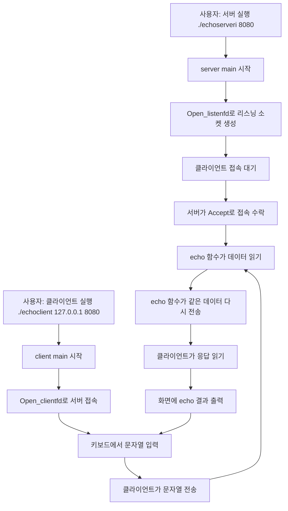
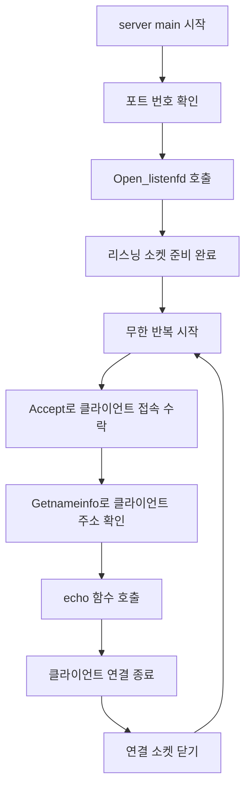
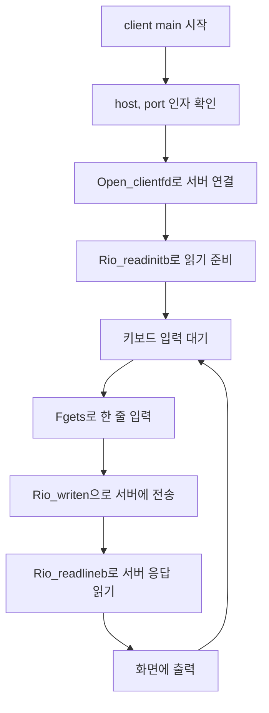
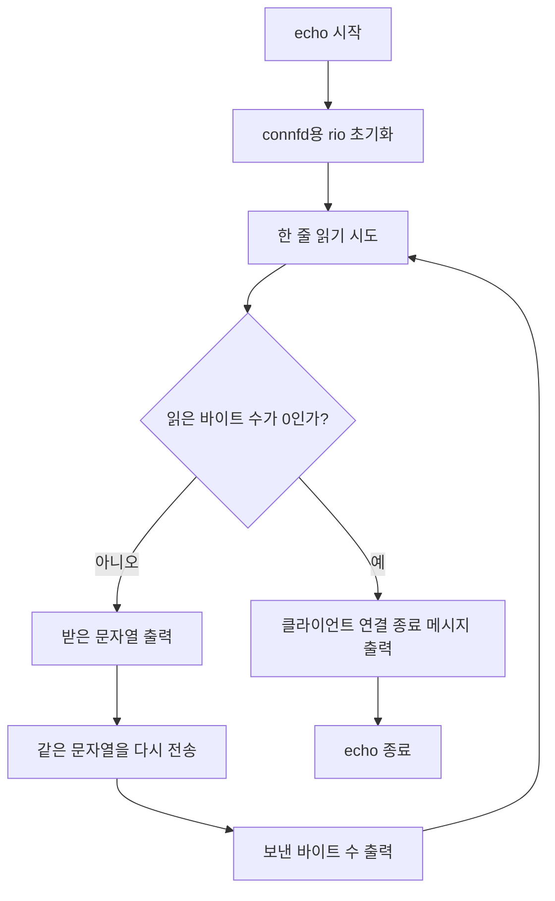

# Echo Study Note

이 문서는 `webproxy-lab/echo` 폴더를 처음 보는 사람을 위한 학습 가이드입니다.  
목표는 아래 4가지를 한 번에 이해하는 것입니다.

1. 이 폴더에서 어떤 프로그램이 만들어지는지
2. 어떤 파일부터 읽어야 덜 헷갈리는지
3. 서버와 클라이언트가 어떻게 연결되는지
4. 각 함수 안에서 실제로 어떤 일이 일어나는지

## 1. 이 폴더에서 만들어지는 프로그램

이 폴더의 코드는 "에코(Echo) 프로그램"을 만듭니다.

에코 프로그램은 아주 단순한 네트워크 예제입니다.

- 클라이언트가 서버에게 문자열을 보냅니다.
- 서버는 그 문자열을 받습니다.
- 서버는 받은 문자열을 그대로 다시 돌려보냅니다.
- 클라이언트는 그 응답을 화면에 출력합니다.

즉, "보낸 내용을 그대로 되돌려주는" 프로그램입니다.

이 폴더에서는 최종적으로 실행 파일 2개가 만들어집니다.

- `echoserveri`
  - 서버 프로그램입니다.
  - 특정 포트에서 접속을 기다립니다.
- `echoclient`
  - 클라이언트 프로그램입니다.
  - 서버에 접속해서 문자열을 보내고, 다시 받은 문자열을 출력합니다.

참고로 이 폴더 안의 세 파일만으로 완전히 끝나는 것은 아닙니다.  
실제 빌드할 때는 같은 폴더 안의 `csapp.h`, `csapp.c`도 함께 사용합니다.

- `csapp.h`: 함수 선언, 자료형, 상수 모음
- `csapp.c`: 실제 네트워크 함수와 입출력 함수 구현

즉, `echo` 폴더는 독립 실행이 가능한 예제 폴더이고,  
`csapp`은 그 안에서 함께 쓰이는 도우미 라이브러리라고 생각하면 이해하기 쉽습니다.

## 2. 어떤 파일부터 읽어야 하나

처음 공부할 때는 아래 순서를 추천합니다.

1. `echoserveri.c`
2. `echo.c`
3. `echoclient.c`
4. `csapp.h`
5. `csapp.c`

이 순서를 추천하는 이유는 아래와 같습니다.

### 2-1. 먼저 `echoserveri.c`

이 파일은 "서버 전체 뼈대"를 보여 줍니다.

- 서버가 어떻게 시작되는지
- 포트를 어떻게 받는지
- 클라이언트를 어떻게 기다리는지
- 접속이 오면 무엇을 호출하는지

즉, 큰 그림을 보기 가장 좋습니다.

### 2-2. 다음은 `echo.c`

이 파일은 서버가 실제로 하는 핵심 일을 담고 있습니다.

- 클라이언트가 보낸 데이터를 읽고
- 그대로 다시 보내는 동작

서버의 "진짜 일"이 여기 들어 있습니다.

### 2-3. 그다음 `echoclient.c`

이 파일은 사용자의 입장에서 프로그램을 보여 줍니다.

- 서버에 접속하고
- 키보드 입력을 보내고
- 응답을 출력하는 흐름

서버를 이해한 뒤 읽으면 훨씬 덜 헷갈립니다.

### 2-4. 마지막으로 `csapp.h`, `csapp.c`

초보자는 이 파일들을 처음부터 전부 읽으려고 하면 지치기 쉽습니다.  
길고, 지금 당장 필요 없는 함수도 많기 때문입니다.

처음에는 아래 함수만 골라서 보면 충분합니다.

- `Open_listenfd`
- `Open_clientfd`
- `Accept`
- `Getnameinfo`
- `Rio_readinitb`
- `Rio_readlineb`
- `Rio_writen`
- `Close`

## 3. 파일별 역할 한눈에 보기

### `echoserveri.c`

서버의 시작점입니다.

- 포트 번호를 받음
- 서버 소켓 생성
- 클라이언트 접속 대기
- 접속이 오면 `echo(connfd)` 호출

여기서 중요한 점:

- `listenfd`: 손님을 기다리는 소켓
- `connfd`: 손님 1명과 실제로 대화하는 소켓

### `echo.c`

서버의 핵심 로직입니다.

- `connfd`를 통해 클라이언트가 보낸 문자열을 읽음
- 읽은 내용을 그대로 다시 `connfd`로 보냄

여기서 중요한 점:

- `connfd`는 문자열이 아니라 "소켓 번호"입니다.
- 그래서 자료형이 `int`입니다.

### `echoclient.c`

클라이언트의 시작점입니다.

- 서버 주소와 포트를 받음
- 서버에 연결
- 키보드 입력을 서버로 전송
- 서버 응답을 출력

## 4. 빌드되면 실제로 무슨 모습인가

개념적으로는 이렇게 생각하면 됩니다.

```text
키보드 입력
   ↓
echoclient
   ↓ 네트워크로 문자열 전송
echoserveri
   ↓
echo 함수가 문자열을 그대로 돌려보냄
   ↓ 네트워크로 응답 전송
echoclient
   ↓
터미널에 응답 출력
```

## 5. 전체 프로그램 흐름 그래프

아래 그래프는 서버와 클라이언트가 함께 어떻게 움직이는지 보여 줍니다.



## 6. 서버 쪽 함수 플로우

서버는 `echoserveri.c`의 `main`에서 시작합니다.



### 서버 흐름을 말로 풀면

1. 서버는 먼저 포트 번호를 받습니다.
2. 그 포트에서 손님을 기다릴 소켓(`listenfd`)을 만듭니다.
3. 무한 반복 안에서 클라이언트 접속을 기다립니다.
4. 접속이 오면 `Accept`가 새로운 연결 소켓 `connfd`를 돌려줍니다.
5. 서버는 그 `connfd`를 `echo` 함수에 넘깁니다.
6. `echo`가 통신을 끝내면 `connfd`를 닫습니다.
7. 그리고 다시 다음 손님을 기다립니다.

## 7. 클라이언트 쪽 함수 플로우

클라이언트는 `echoclient.c`의 `main`에서 시작합니다.



### 클라이언트 흐름을 말로 풀면

1. 클라이언트는 서버 주소와 포트 번호를 입력받습니다.
2. 서버에 접속합니다.
3. 사용자가 키보드로 한 줄 입력합니다.
4. 그 문자열을 서버에 보냅니다.
5. 서버가 돌려준 문자열을 읽습니다.
6. 화면에 출력합니다.
7. 다시 입력을 기다립니다.

## 8. `echo()` 함수 내부 플로우

이 함수는 서버에서 가장 중요한 함수입니다.



### `echo()`를 정말 쉽게 설명하면

이 함수는 아래만 반복합니다.

1. 한 줄 읽기
2. 그대로 다시 보내기
3. 또 읽기

즉, "복사해서 다시 돌려주는 기계"라고 생각하면 됩니다.

## 9. 각 함수 안의 핵심 변수 설명

초보자가 가장 헷갈리는 부분이 "변수 이름"과 "자료형"입니다.  
여기서는 꼭 알아야 하는 것만 정리합니다.

### `argc`, `argv`

`main(int argc, char **argv)`에서 가장 많이 헷갈리는 두 변수입니다.

먼저 결론부터:

- `argc`는 사용자가 실행할 때 입력한 전체 단어 개수입니다.
- `argv`는 사용자가 입력한 각 단어 문자열이 들어 있는 배열입니다.

즉:

- `argc`는 "몇 개 들어왔는가"
- `argv`는 "무엇이 들어왔는가"

입니다.

#### 서버 실행 예시

사용자가 서버를 이렇게 실행하면:

```bash
./echoserveri 8080
```

프로그램 입장에서는 문자열 2개가 들어옵니다.

- `./echoserveri`
- `8080`

따라서:

```c
argc = 2
argv[0] = "./echoserveri"
argv[1] = "8080"
```

여기서 중요한 점:

- `argc`는 포트 번호가 아닙니다.
- `argc`는 그냥 "입력 항목 수"인 숫자입니다.
- 포트 번호 문자열 `"8080"`은 `argv[1]`에 들어 있습니다.

#### 클라이언트 실행 예시

사용자가 클라이언트를 이렇게 실행하면:

```bash
./echoclient 127.0.0.1 8080
```

프로그램 입장에서는 문자열 3개가 들어옵니다.

- `./echoclient`
- `127.0.0.1`
- `8080`

따라서:

```c
argc = 3
argv[0] = "./echoclient"
argv[1] = "127.0.0.1"
argv[2] = "8080"
```

여기서도 중요한 점:

- `argc` 안에 `"8080"`이 들어가는 것이 아닙니다.
- `"8080"`은 `argv[2]`에 들어 있습니다.
- `argc`는 숫자 `3`입니다.

#### 왜 `char **argv` 인가

문자열 하나는 보통 `char *`로 다룹니다.

그런데 `argv`에는 문자열이 여러 개 들어 있습니다.

즉:

- 문자열 하나: `char *`
- 문자열 여러 개의 목록: `char **`

그래서 `main` 함수 매개변수 타입이 `char **argv`입니다.

#### 아주 짧게 다시 정리

- `argc`: 개수
- `argv[0]`: 프로그램 이름
- `argv[1]`: 첫 번째 실제 인자
- `argv[2]`: 두 번째 실제 인자

즉, 포트 번호는 `argc`가 아니라 `argv` 안 문자열로 들어옵니다.

### `listenfd`

- 자료형: `int`
- 의미: 서버가 손님을 기다리는 소켓 번호
- 왜 `int`인가:
  - 운영체제는 파일, 터미널, 소켓을 전부 "정수 번호"로 관리합니다.
  - 그래서 소켓도 문자열이 아니라 `int`입니다.

### `connfd`

- 자료형: `int`
- 의미: 서버와 클라이언트가 실제로 대화할 때 쓰는 소켓 번호
- 왜 `int`인가:
  - 이것도 운영체제가 붙여 준 번호이기 때문입니다.

중요:

- `connfd`는 사용자가 입력한 문자열이 아닙니다.
- 사용자의 `"hello"` 같은 입력은 `buf`에 들어갑니다.
- `connfd`는 그 데이터를 주고받을 "통로 번호"입니다.

### `buf`

- 자료형: `char buf[MAXLINE]`
- 의미: 문자열을 저장하는 배열
- 왜 `char[]`인가:
  - C에서는 문자열을 `char` 배열로 저장합니다.
  - 한 글자씩 저장하고, 마지막에 문자열 끝 표시(`\0`)가 붙습니다.

### `host`, `port`

- 자료형: `char *`
- 의미: 문자열의 시작 주소를 가리키는 포인터
- 왜 `char *`인가:
  - `argv` 안에 이미 문자열이 들어 있으므로,
  - 새 배열을 만들기보다 그 문자열을 "가리키기만" 하면 됩니다.

### `n`, `len`

- 자료형: `size_t`
- 의미: 읽은 바이트 수 또는 문자열 길이
- 왜 `size_t`인가:
  - 길이, 크기, 바이트 수를 저장할 때 자주 쓰는 표준 자료형입니다.
  - 음수가 아닌 크기를 표현하기에 적합합니다.

### `rio`

- 자료형: `rio_t`
- 의미: 버퍼 입출력을 쉽게 하기 위한 구조체
- 왜 구조체인가:
  - 읽기 버퍼, 현재 위치, 남은 바이트 수 같은 정보가 여러 개 필요해서
  - 하나의 변수로 묶기 위해 구조체를 사용합니다.

## 10. 처음 보는 함수들 쉬운 설명

### `Open_listenfd(port)`

서버용 함수입니다.

- 특정 포트에서 접속을 기다릴 수 있는 소켓을 만듭니다.
- 결과로 소켓 번호를 돌려줍니다.

쉽게 말하면:

"이 포트로 손님이 오면 내가 받을 준비를 하겠다"라고 선언하는 단계입니다.

### `Open_clientfd(host, port)`

클라이언트용 함수입니다.

- 특정 서버 주소와 포트로 접속합니다.
- 연결 성공 시 소켓 번호를 돌려줍니다.

쉽게 말하면:

"저 서버에게 전화 걸기"입니다.

### `Accept(listenfd, ...)`

서버가 손님을 받는 함수입니다.

- 누군가 접속할 때까지 기다립니다.
- 접속이 오면 그 손님과 대화할 새 소켓 번호를 돌려줍니다.

쉽게 말하면:

"전화벨이 울릴 때까지 기다렸다가 전화를 받기"입니다.

### `Rio_readinitb(&rio, fd)`

- `rio` 구조체가 특정 소켓(`fd`)에서 읽도록 준비합니다.

쉽게 말하면:

"이 읽기 도구는 이제 이 소켓을 읽어라"라고 설정하는 것입니다.

### `Rio_readlineb(&rio, buf, MAXLINE)`

- 한 줄을 읽어서 `buf`에 저장합니다.
- 몇 바이트 읽었는지를 반환합니다.

### `Rio_writen(fd, buf, n)`

- `buf`에 있는 데이터를 `n`바이트만큼 보냅니다.

### `Close(fd)`

- 소켓을 닫습니다.
- 통신이 끝나면 꼭 해 줘야 하는 정리 작업입니다.

## 11. 초보자가 특히 자주 헷갈리는 포인트

### 1. 서버 소켓은 왜 2종류인가

서버에는 보통 소켓이 2종류 있습니다.

- `listenfd`
  - 손님을 기다리는 용도
- `connfd`
  - 손님 1명과 실제 대화하는 용도

비유하면:

- `listenfd`는 매장 입구
- `connfd`는 손님과 실제로 대화하는 상담 창구

### 2. 왜 서버에서 `echo(connfd)`를 따로 뺐나

이유는 역할 분리입니다.

- `main`: 손님 받기
- `echo`: 받은 데이터 처리하기

이렇게 나누면 읽기도 쉽고 수정도 쉽습니다.

### 3. 왜 `while (1)`을 쓰나

서버는 손님 한 명만 받고 끝나면 안 되기 때문입니다.  
계속 다음 손님을 받아야 하므로 무한 반복을 씁니다.

### 4. 왜 `while ((n = Rio_readlineb(...)) != 0)` 인가

이 뜻은:

- 한 줄 읽고
- 읽은 양이 0이 아니면 계속하고
- 0이면 종료

입니다.

즉 "데이터가 있는 동안 반복"입니다.

## 12. 직접 실행할 때 머릿속으로 그려야 하는 장면

터미널 1:

```bash
./webproxy-lab/echo/echoserveri 8080
```

터미널 2:

```bash
./webproxy-lab/echo/echoclient 127.0.0.1 8080
```

클라이언트에서 이렇게 입력:

```text
hello
```

그러면 머릿속에서는 아래 일이 일어납니다.

1. 클라이언트가 `hello`를 `buf`에 저장합니다.
2. 클라이언트가 그 문자열을 서버로 보냅니다.
3. 서버의 `echo()`가 그 문자열을 읽습니다.
4. 서버가 같은 문자열을 다시 보냅니다.
5. 클라이언트가 그 문자열을 다시 받아 출력합니다.

## 13. 마지막 정리

이 폴더의 핵심은 딱 한 문장으로 정리할 수 있습니다.

`echoclient`가 문자열을 보내면, `echoserveri`가 `echo()`를 통해 그 문자열을 그대로 돌려준다.

처음 공부할 때는 아래 순서만 기억하면 충분합니다.

1. `echoserveri.c`로 큰 흐름 보기
2. `echo.c`로 핵심 처리 보기
3. `echoclient.c`로 사용자 쪽 흐름 보기
4. 모르는 함수만 `csapp.h`, `csapp.c`에서 찾아보기

이 순서대로 보면 네트워크 코드가 처음이어도 훨씬 덜 무섭습니다.
