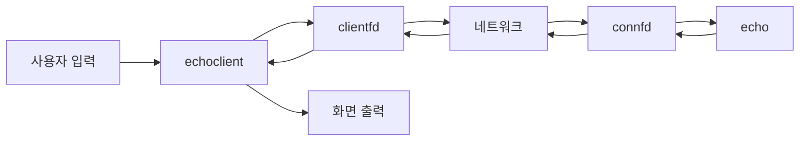
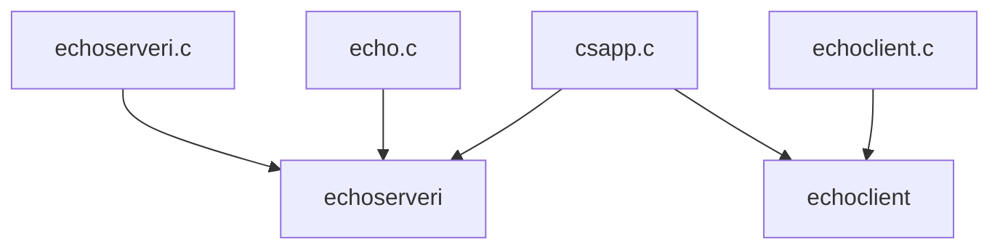
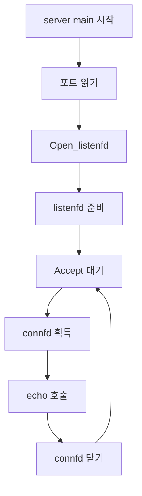
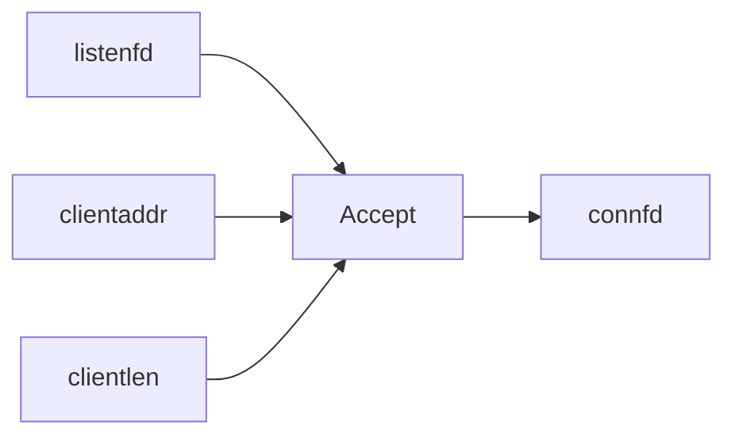
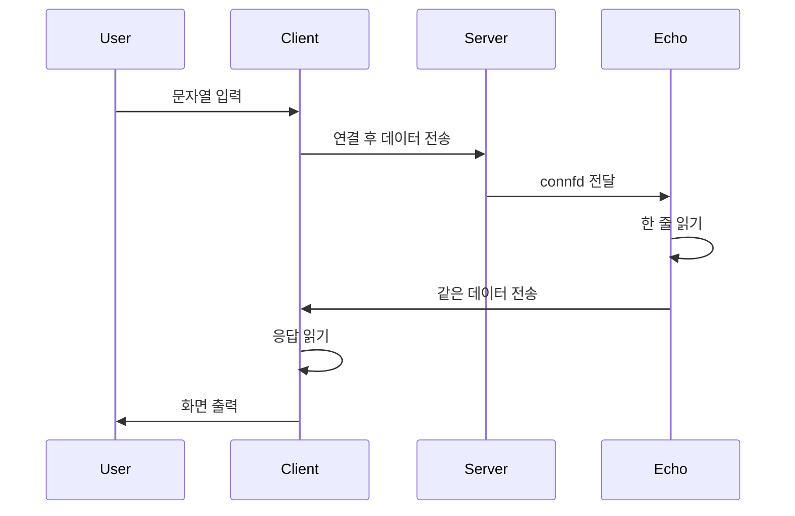
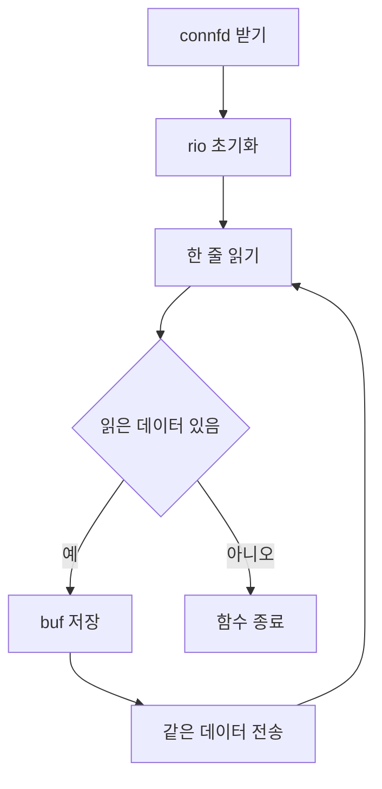
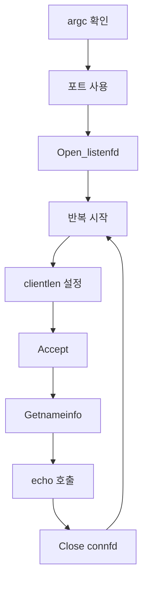

# Socket Study

이 문서는 `webproxy-lab/echo` 폴더의 실습이 어떤 이론을 다루는지 정리한 학습 문서입니다.  
설명 범위는 다음과 같습니다.

1. 소켓이 무엇인지
2. 소켓 인터페이스가 무엇인지
3. 클라이언트와 서버가 연결될 때 어떤 단계가 필요한지
4. 문자열을 네트워크로 읽고 쓸 때 어떤 함수가 필요한지
5. 위 개념들이 현재 `echo` 실습 코드의 어디에 구현되어 있는지

이 문서는 초보자를 기준으로 씁니다.  
그래서 "용어 정의"와 "코드 위치"를 함께 설명합니다.

## 0. 먼저 보는 전체 구조

이 실습의 전체 구조를 먼저 보면, 뒤의 설명이 훨씬 덜 어렵습니다.



이 그림에서 중요한 점은 아래와 같습니다.

- 사용자가 입력한 문자열은 먼저 `echoclient`가 받습니다.
- 클라이언트는 `clientfd`를 통해 네트워크로 데이터를 보냅니다.
- 서버는 `connfd`를 통해 그 데이터를 받습니다.
- `echo` 함수가 데이터를 읽고 다시 보냅니다.
- 다시 돌아온 데이터는 클라이언트가 읽어서 화면에 출력합니다.

## 1. 이 실습의 목적

`echo` 폴더의 실습은 단순히 문자열을 주고받는 프로그램을 만드는 것이 목적이 아닙니다.  
더 정확히 말하면, 아래 개념들을 실제 코드로 경험하는 것이 목적입니다.

- 서버 프로그램이 특정 포트에서 연결을 기다리는 방법
- 클라이언트 프로그램이 서버에 연결하는 방법
- 연결이 성립된 뒤 데이터를 읽고 쓰는 방법
- 연결 하나를 나타내는 값이 왜 `int`인지 이해하는 것
- 주소 정보와 포트 정보가 왜 별도 자료형으로 관리되는지 이해하는 것
- 네트워크 입출력과 일반 키보드 입력이 어떻게 연결되는지 이해하는 것

즉, 이 실습은 "소켓 네트워크 프로그래밍의 가장 작은 형태"를 배우는 예제입니다.

## 2. 이 폴더에서 만들어지는 프로그램

이 폴더에서는 두 개의 실행 프로그램이 만들어집니다.

- `echoserveri`
- `echoclient`

### `echoserveri`

서버 프로그램입니다.

- 포트 번호를 입력받습니다.
- 그 포트에서 클라이언트 연결을 기다립니다.
- 연결이 들어오면 데이터를 읽습니다.
- 읽은 데이터를 그대로 다시 보냅니다.

### `echoclient`

클라이언트 프로그램입니다.

- 서버 주소와 포트 번호를 입력받습니다.
- 서버에 연결합니다.
- 사용자가 입력한 문자열을 서버에 보냅니다.
- 서버가 다시 보낸 문자열을 읽어서 출력합니다.



## 2-1. 왜 내가 소켓, IP, 연결 같은 걸 알아야 하나

처음 배우면 이런 의문이 드는 것이 자연스럽습니다.

- "네트워크는 라우터가 알아서 처리하는 것 아닌가?"
- "IP나 연결은 운영체제가 하는 일 아닌가?"
- "왜 내가 작성하는 프로그램이 이것까지 신경 써야 하지?"

결론부터 말하면, 전부 일부만 맞고 일부는 틀립니다.

- 라우터는 네트워크 경로 전달을 담당합니다.
- 운영체제는 소켓과 TCP/IP 기능을 제공합니다.
- 하지만 "어디에 연결할지", "언제 읽고 쓸지", "받은 데이터를 어떻게 처리할지"는 프로그램이 결정해야 합니다.

즉, 네트워크 통신은 한 곳이 혼자서 다 하는 일이 아니라  
여러 층이 역할을 나눠서 처리하는 일입니다.

## 2-2. 라우터, 운영체제, 프로그램의 책임 구분

이 실습을 이해하려면 책임이 어떻게 나뉘는지 먼저 알아야 합니다.

### 라우터의 책임

라우터는 네트워크 장비입니다.

라우터가 담당하는 일:

- 패킷을 어느 방향으로 보낼지 결정
- 네트워크 사이에서 전달
- 목적지 방향으로 트래픽 중계

라우터가 하지 않는 일:

- 내 프로그램 안의 `main()` 실행
- 어떤 문자열을 보낼지 결정
- 서버가 받은 문자열을 어떻게 처리할지 결정
- 내 프로그램 안에서 어떤 함수가 호출될지 결정

즉, 라우터는 "네트워크 중간 전달"을 담당하지,  
내 프로그램 로직을 실행하지는 않습니다.

### 운영체제의 책임

운영체제는 프로그램이 네트워크 기능을 사용할 수 있게 인터페이스를 제공합니다.

운영체제가 담당하는 일:

- 소켓 생성과 관리
- 파일 디스크립터 번호 부여
- TCP/IP 기능 제공
- 연결 요청 처리
- 실제 데이터 송수신 지원

운영체제가 하지 않는 일:

- 어떤 서버 주소에 연결할지 결정
- 어떤 포트 번호를 쓸지 결정
- 읽은 데이터를 출력할지 저장할지 버릴지 결정
- 클라이언트가 보낸 문자열을 다시 돌려보낼지 결정

즉, 운영체제는 "기능과 통로"를 제공하지만,  
그 기능을 어떤 순서로 어떻게 사용할지는 프로그램이 결정합니다.

### 프로그램의 책임

우리가 작성하는 프로그램은 네트워크 기능을 "사용하는 주체"입니다.

프로그램이 담당하는 일:

- 서버 주소 선택
- 포트 번호 선택
- 연결 시작 시점 결정
- 연결 수락 후 어떤 함수로 처리할지 결정
- 읽은 데이터를 어떻게 해석할지 결정
- 응답을 보낼지 말지 결정
- 언제 연결을 닫을지 결정

이 실습에서 그 책임은 코드에 직접 나타납니다.

- 클라이언트는 [echoclient.c:60](/home/leeminjeong/workspace/python_project/jungle/data_structures_docker/webproxy-lab/echo/echoclient.c:60) 에서 어느 서버로 연결할지 결정합니다.
- 서버는 [echoserveri.c:57](/home/leeminjeong/workspace/python_project/jungle/data_structures_docker/webproxy-lab/echo/echoserveri.c:57) 에서 어느 포트를 열지 결정합니다.
- 서버는 [echoserveri.c:82](/home/leeminjeong/workspace/python_project/jungle/data_structures_docker/webproxy-lab/echo/echoserveri.c:82) 에서 연결을 `echo` 함수로 처리하기로 결정합니다.
- `echo` 함수는 [echo.c:43](/home/leeminjeong/workspace/python_project/jungle/data_structures_docker/webproxy-lab/echo/echo.c:43) 에서 받은 데이터를 그대로 다시 보내기로 결정합니다.

## 2-3. 이 실습에서 IP는 어디에 있고, 왜 코드에 많이 안 보이나

초보자가 자주 헷갈리는 부분입니다.

IP는 네트워크 주소 체계입니다.  
하지만 이 실습에서는 IP 관련 복잡한 부분을 우리가 직접 다루지 않습니다.

그 이유는 `csapp` 라이브러리와 운영체제가 많은 부분을 대신 처리해 주기 때문입니다.

예를 들어 클라이언트 코드는 아래처럼 씁니다.

```c
clientfd = Open_clientfd(host, port);
```

여기서 `host`에 `"127.0.0.1"` 같은 IP 주소를 넣을 수 있습니다.  
하지만 프로그램은 IP 패킷을 직접 만들지 않습니다.

프로그램이 하는 일:

- 어떤 주소로 연결할지 지정
- 어떤 포트로 연결할지 지정

운영체제가 하는 일:

- 그 주소로 실제 연결 절차 수행
- TCP/IP 스택을 통해 데이터 송수신

즉, 우리는 IP를 "직접 구현"하지는 않지만,  
IP 주소를 사용하는 프로그램을 작성하고 있는 것입니다.

## 2-4. 이 실습에서 내가 실제로 책임지는 부분

이 실습에서 우리가 책임지는 것은 아래입니다.

1. 서버와 클라이언트라는 두 프로그램 구조를 만든다
2. 서버가 어느 포트를 열지 정한다
3. 클라이언트가 어느 주소와 포트로 연결할지 정한다
4. 연결 후 어떤 데이터를 읽고 쓸지 정한다
5. 받은 데이터를 어떻게 처리할지 정한다
6. 통신을 언제 종료할지 정한다

반대로 우리가 직접 구현하지 않는 것은 아래입니다.

1. 패킷이 라우터를 지나가는 방식
2. TCP가 재전송하는 세부 동작
3. IP 헤더의 내부 구성
4. 운영체제가 소켓 번호를 관리하는 내부 방식

즉, 이 실습은 "네트워크 전체를 구현하는 실습"이 아니라  
"운영체제가 제공한 네트워크 기능을 프로그램이 올바르게 사용하는 실습"입니다.

## 2-5. 이 개념이 현재 코드에서 보이는 위치

아래 표처럼 보면 책임 구분이 더 분명해집니다.

| 개념 | 누가 담당하나 | 현재 코드에서 보이는 위치 |
|---|---|---|
| 포트 선택 | 프로그램 | [echoserveri.c:57](/home/leeminjeong/workspace/python_project/jungle/data_structures_docker/webproxy-lab/echo/echoserveri.c:57) |
| 서버 주소 선택 | 프로그램 | [echoclient.c:48](/home/leeminjeong/workspace/python_project/jungle/data_structures_docker/webproxy-lab/echo/echoclient.c:48), [echoclient.c:60](/home/leeminjeong/workspace/python_project/jungle/data_structures_docker/webproxy-lab/echo/echoclient.c:60) |
| 연결 기능 제공 | 운영체제와 소켓 인터페이스 | `Open_listenfd`, `Open_clientfd`, `Accept` |
| 데이터 전송 기능 제공 | 운영체제와 소켓 인터페이스 | `Rio_readlineb`, `Rio_writen` |
| 받은 데이터를 그대로 돌려보낼지 결정 | 프로그램 | [echo.c:43](/home/leeminjeong/workspace/python_project/jungle/data_structures_docker/webproxy-lab/echo/echo.c:43) |
| 네트워크 경로 전달 | 라우터와 네트워크 장비 | 현재 코드에 직접 구현되지 않음 |

## 2-6. 소켓, 패킷, 프레임, 라우터는 누가 담당하나

이 부분은 네트워크를 처음 배울 때 가장 헷갈리기 쉬운 지점입니다.  
용어는 모두 네트워크 관련이지만, 서로 같은 층의 일이 아닙니다.

먼저 결론부터 정리하면 아래와 같습니다.

| 개념 | 주로 누가 담당하나 | 우리가 이 실습에서 직접 작성하나 |
|---|---|---|
| 소켓 | 운영체제 | 직접 구현하지 않고 사용함 |
| 파일 디스크립터 | 운영체제 | 직접 구현하지 않고 사용함 |
| 패킷 | 운영체제의 네트워크 스택 | 직접 구현하지 않음 |
| 프레임 | 네트워크 인터페이스와 드라이버 | 직접 구현하지 않음 |
| 라우팅 | 라우터와 네트워크 장비 | 직접 구현하지 않음 |
| 어떤 주소로 연결할지 결정 | 프로그램 | 직접 작성함 |
| 어떤 데이터를 보낼지 결정 | 프로그램 | 직접 작성함 |
| 받은 데이터를 어떻게 처리할지 결정 | 프로그램 | 직접 작성함 |

### 소켓은 누가 만드나

소켓은 보통 운영체제가 만듭니다.

프로그램은 소켓을 "직접 발명"하거나 "직접 구현"하는 것이 아니라,  
운영체제가 제공하는 소켓 기능을 요청해서 사용합니다.

즉:

- 프로그램은 소켓 생성 함수를 호출합니다
- 운영체제는 소켓을 만들어 줍니다
- 프로그램은 그 결과로 파일 디스크립터를 받습니다

이 실습에서는 `csapp`의 wrapper를 쓰기 때문에  
`socket()` 같은 원시 함수가 직접 보이지 않고,
대신 `Open_listenfd`, `Open_clientfd`가 보입니다.

### 패킷은 누가 만드나

보통 프로그램이 직접 패킷을 만들지 않습니다.

일반적인 소켓 프로그래밍에서는:

- 프로그램이 "이 데이터를 보내라"라고 요청합니다
- 운영체제가 그 데이터를 TCP/IP 규칙에 맞게 처리합니다
- 그 과정에서 패킷 수준의 처리가 이루어집니다

즉, 이 실습에서 우리는 패킷 헤더를 직접 작성하지 않습니다.

우리가 하는 일:

- 문자열 준비
- 어느 연결로 보낼지 결정

운영체제가 하는 일:

- 그 문자열을 실제 네트워크 전송 단위로 다룸

### 프레임은 누가 만드나

프레임도 일반적인 응용 프로그램이 직접 만들지 않습니다.

프레임은 더 아래 단계의 전송 단위입니다.  
보통 네트워크 인터페이스, 드라이버, 운영체제의 하위 네트워크 계층이 처리합니다.

즉, 이 실습 코드 안에는 프레임을 직접 만드는 코드가 없습니다.

### 라우터는 무슨 일을 하나

라우터는 네트워크 중간에서 패킷을 전달하는 장비입니다.

라우터가 하는 일:

- 들어온 패킷을 받음
- 목적지 방향을 판단함
- 다음 경로로 전달함

라우터가 하지 않는 일:

- 내 프로그램의 소켓 생성
- 내 프로그램의 파일 디스크립터 관리
- 내 프로그램의 `main()` 실행
- 내 프로그램 버퍼에 문자열 저장
- 받은 문자열을 다시 보낼지 말지 결정

즉, 라우터는 프로그램 로직을 담당하지 않습니다.

## 2-7. 왜 이것을 프로그램 작성자가 알아야 하나

여기서 중요한 질문이 나옵니다.

"어차피 운영체제와 네트워크 장비가 많이 해 주는데,  
왜 내가 소켓, 연결, 파일 디스크립터를 알아야 하지?"

이유는 프로그램이 아래 결정을 직접 내려야 하기 때문입니다.

1. 서버인지 클라이언트인지
2. 어떤 주소와 포트를 사용할지
3. 언제 연결할지
4. 언제 읽을지
5. 언제 쓸지
6. 받은 데이터를 어떻게 처리할지
7. 언제 연결을 닫을지

운영체제가 대신 해 주지 않는 것:

- 비즈니스 로직
- 문자열 처리 로직
- 응답 정책
- 프로그램 흐름 제어

이 실습에서는 그 결정이 코드에 보입니다.

- [echoclient.c:60](/home/leeminjeong/workspace/python_project/jungle/data_structures_docker/webproxy-lab/echo/echoclient.c:60): 어디로 연결할지 결정
- [echoclient.c:79](/home/leeminjeong/workspace/python_project/jungle/data_structures_docker/webproxy-lab/echo/echoclient.c:79): 무엇을 보낼지 결정
- [echo.c:43](/home/leeminjeong/workspace/python_project/jungle/data_structures_docker/webproxy-lab/echo/echo.c:43): 받은 데이터를 그대로 다시 보낼지 결정
- [echoserveri.c:89](/home/leeminjeong/workspace/python_project/jungle/data_structures_docker/webproxy-lab/echo/echoserveri.c:89): 언제 연결을 닫을지 결정

즉, 네트워크의 모든 층을 우리가 구현하지는 않지만,  
응용 프로그램 층에서 어떤 네트워크 동작을 요청할지는 우리가 책임집니다.

## 3. 소켓이 무엇인가

소켓은 네트워크 통신을 위해 운영체제가 제공하는 인터페이스입니다.

조금 더 정확히 쓰면:

- 프로그램이 네트워크를 통해 데이터를 주고받으려면
- 운영체제에게 "통신용 자원"을 요청해야 하고
- 그 자원을 프로그램이 다룰 수 있도록 식별자가 필요한데
- 그 식별자가 소켓과 연결된 파일 디스크립터입니다

중요한 점은 다음입니다.

- 소켓 자체는 문자열이 아닙니다.
- 소켓은 정수 번호로 식별됩니다.
- 그래서 코드에서 소켓 관련 변수는 보통 `int` 타입입니다.

이 실습에서 그 예시는 아래와 같습니다.

- [echoserveri.c](/home/leeminjeong/workspace/python_project/jungle/data_structures_docker/webproxy-lab/echo/echoserveri.c:21) 의 `listenfd`
- [echoserveri.c](/home/leeminjeong/workspace/python_project/jungle/data_structures_docker/webproxy-lab/echo/echoserveri.c:25) 의 `connfd`
- [echoclient.c](/home/leeminjeong/workspace/python_project/jungle/data_structures_docker/webproxy-lab/echo/echoclient.c:15) 의 `clientfd`
- [echo.c](/home/leeminjeong/workspace/python_project/jungle/data_structures_docker/webproxy-lab/echo/echo.c:12) 의 `connfd` 매개변수

## 4. 파일 디스크립터란 무엇인가

파일 디스크립터는 운영체제가 열어 둔 입출력 자원을 구분하기 위해 사용하는 정수 번호입니다.

이 문맥에서 입출력 자원에는 다음이 포함됩니다.

- 일반 파일
- 터미널
- 파이프
- 소켓

그래서 네트워크 연결도 결국 프로그램 입장에서는 "정수 번호 하나로 접근하는 입출력 자원"으로 보입니다.

이 실습에서 그 의미는 매우 중요합니다.

- `listenfd`는 "연결을 기다리는 소켓 번호"
- `connfd`는 "클라이언트 한 명과 연결된 소켓 번호"
- `clientfd`는 "클라이언트가 서버와 연결된 소켓 번호"

이 값들은 문자열을 저장하지 않습니다.  
문자열은 `buf` 같은 `char` 배열이 저장합니다.

### 초보자 기준으로 다시 정리

처음 배우는 입장에서는 여기서 가장 많이 헷갈립니다.

- `connfd`는 사용자가 입력한 문자열이 아닙니다.
- `connfd`는 문자열을 주고받는 "연결 번호"입니다.
- 운영체제는 이 연결을 정수 번호로 관리합니다.
- 그래서 자료형이 `char *`가 아니라 `int`입니다.

예를 들어:

- `"hello"` 같은 실제 문자열 데이터는 `buf`에 저장됩니다.
- 그 문자열을 어디로 읽고 어디로 쓸지를 알려 주는 값이 `connfd`입니다.

현재 실습 코드에서 이 구분은 아래처럼 나타납니다.

```c
int connfd;
char buf[MAXLINE];
```

의미는 아래와 같습니다.

- `connfd`: 연결 자체를 가리키는 번호
- `buf`: 실제 문자 데이터를 저장하는 공간

즉, 파일 디스크립터는 "데이터 그 자체"가 아니라  
"그 데이터가 드나드는 입출력 대상 번호"입니다.

## 5. 소켓 인터페이스란 무엇인가

소켓 인터페이스는 네트워크 통신을 위해 운영체제가 제공하는 함수 집합입니다.

이 실습에서는 CS:APP에서 제공하는 wrapper 함수들을 사용합니다.  
wrapper 함수는 원래 시스템 호출을 직접 쓰기 쉽게 감싼 함수입니다.

이 실습에서 핵심이 되는 인터페이스는 아래와 같습니다.

- `Open_listenfd`
- `Open_clientfd`
- `Accept`
- `Getnameinfo`
- `Rio_readinitb`
- `Rio_readlineb`
- `Rio_writen`
- `Close`

이 함수들이 각각 어떤 역할을 하는지는 아래에서 코드 위치와 함께 설명합니다.

## 5-1. RIO 시리즈란 무엇인가

이 실습에서 나오는 `Rio_*` 함수들은 CS:APP에서 제공하는 입출력 도우미 함수들입니다.

여기서 `RIO`는 Robust I/O의 약자입니다.  
이 이름은 "입출력을 조금 더 안정적으로 다루기 위한 함수 묶음" 정도로 이해하면 됩니다.

이 실습에서 꼭 알아야 하는 것은 3개입니다.

- `Rio_readinitb`
- `Rio_readlineb`
- `Rio_writen`

### 왜 그냥 `read`, `write` 대신 이것을 쓰는가

초보자 입장에서는 아래 이유로 `Rio_*`가 더 읽기 쉽습니다.

- 한 줄 단위로 읽는 함수가 준비되어 있습니다.
- 버퍼 상태를 구조체로 관리합니다.
- 클라이언트와 서버 코드 흐름을 보기 쉽습니다.

즉, 이 실습에서는 "네트워크 통신의 핵심 흐름"에 집중하기 위해  
조금 더 다루기 쉬운 함수 묶음을 사용한다고 보면 됩니다.

### `Rio_readinitb`

이 함수는 읽기 준비를 합니다.

정확히는:

- `rio_t` 구조체 하나를 만들고
- 그 구조체가 특정 파일 디스크립터에서 읽도록 연결합니다

예를 들면 아래 코드입니다.

```c
Rio_readinitb(&rio, connfd);
```

뜻은 다음과 같습니다.

- `rio`라는 읽기 도구를 준비하고
- 그 읽기 도구가 `connfd` 소켓에서 읽게 만든다

### `Rio_readlineb`

이 함수는 한 줄을 읽습니다.

예:

```c
Rio_readlineb(&rio, buf, MAXLINE)
```

뜻은 다음과 같습니다.

- `rio`를 사용해서
- 최대 `MAXLINE`까지
- 한 줄 읽고
- 결과를 `buf`에 저장한다

즉, 실제 문자열 데이터는 `buf`에 들어갑니다.

### `Rio_writen`

이 함수는 지정한 바이트 수만큼 데이터를 보냅니다.

예:

```c
Rio_writen(connfd, buf, n);
```

뜻은 다음과 같습니다.

- `buf` 안에 있는 데이터를
- `n` 바이트만큼
- `connfd` 연결을 통해 보낸다

즉, `connfd`는 통로 번호이고, `buf`는 실제 데이터입니다.

### `rio_t`는 무엇인가

`rio_t`는 `Rio_*` 함수들이 읽기 상태를 기억하기 위해 사용하는 구조체입니다.

왜 필요한가:

- 한 번에 모든 데이터를 단순하게 읽는 것이 아니라
- 내부 버퍼를 유지하고
- 어디까지 읽었는지 기억해야 하기 때문입니다

그래서 `char[]` 하나만으로는 부족하고,  
상태를 묶어 둔 구조체가 필요합니다.

이 문서의 나중 섹션에서 나오는 `Rio_readinitb`, `Rio_readlineb`, `Rio_writen` 설명은  
지금의 이 기본 개념 위에 세부 동작을 더 얹은 것입니다.

## 6. 서버가 준비되는 과정

서버는 `echoserveri.c`의 `main`에서 시작합니다.

핵심 코드는 아래 구간입니다.

- [echoserveri.c:18](/home/leeminjeong/workspace/python_project/jungle/data_structures_docker/webproxy-lab/echo/echoserveri.c:18) `main` 시작
- [echoserveri.c:57](/home/leeminjeong/workspace/python_project/jungle/data_structures_docker/webproxy-lab/echo/echoserveri.c:57) `Open_listenfd(argv[1])`
- [echoserveri.c:70](/home/leeminjeong/workspace/python_project/jungle/data_structures_docker/webproxy-lab/echo/echoserveri.c:70) `Accept(...)`



### `Open_listenfd`

`Open_listenfd`는 서버가 특정 포트에서 연결을 기다릴 수 있게 준비하는 함수입니다.

이 함수가 호출되는 위치:

- [echoserveri.c:57](/home/leeminjeong/workspace/python_project/jungle/data_structures_docker/webproxy-lab/echo/echoserveri.c:57)

입력:

- 포트 번호 문자열

출력:

- 리스닝 소켓의 파일 디스크립터

이 함수가 끝난 뒤에는 서버가 해당 포트에서 연결을 받을 준비가 됩니다.

이 실습에서 그 반환값은 `listenfd`에 저장됩니다.

```c
listenfd = Open_listenfd(argv[1]);
```

여기서 `argv[1]`이 문자열인 이유는 이 함수가 포트를 문자열로 받기 때문입니다.

## 7. 클라이언트가 서버에 연결하는 과정

클라이언트는 `echoclient.c`의 `main`에서 시작합니다.

핵심 코드는 아래 구간입니다.

- [echoclient.c:12](/home/leeminjeong/workspace/python_project/jungle/data_structures_docker/webproxy-lab/echo/echoclient.c:12) `main` 시작
- [echoclient.c:60](/home/leeminjeong/workspace/python_project/jungle/data_structures_docker/webproxy-lab/echo/echoclient.c:60) `Open_clientfd(host, port)`

### `Open_clientfd`

`Open_clientfd`는 클라이언트가 서버에 연결할 때 쓰는 함수입니다.

이 함수가 호출되는 위치:

- [echoclient.c:60](/home/leeminjeong/workspace/python_project/jungle/data_structures_docker/webproxy-lab/echo/echoclient.c:60)

입력:

- 서버 주소 문자열
- 포트 번호 문자열

출력:

- 서버와 연결된 소켓의 파일 디스크립터

코드:

```c
clientfd = Open_clientfd(host, port);
```

여기서 `host`와 `port`가 `char *`인 이유는 이 값들이 문자열이기 때문입니다.

- `host` 예: `"127.0.0.1"`
- `port` 예: `"8080"`

이 함수가 성공하면 클라이언트는 서버와 통신할 수 있는 소켓 번호를 `clientfd`에 갖게 됩니다.

## 8. 서버가 연결을 수락하는 과정

클라이언트가 연결 요청을 보내면 서버는 그 요청을 받아야 합니다.

이 작업은 `Accept`가 담당합니다.

호출 위치:

- [echoserveri.c:70](/home/leeminjeong/workspace/python_project/jungle/data_structures_docker/webproxy-lab/echo/echoserveri.c:70)

코드:

```c
connfd = Accept(listenfd, (SA *)&clientaddr, &clientlen);
```



이 줄에서 중요한 점은 아래와 같습니다.

### `listenfd`

이미 서버가 준비해 둔 리스닝 소켓입니다.  
서버는 이 소켓으로 "새 연결 요청"을 기다립니다.

### `connfd`

`Accept`의 반환값입니다.  
새 클라이언트와 실제 통신할 때 사용할 연결 소켓 번호입니다.

즉, 서버는 다음 두 종류의 소켓을 동시에 갖습니다.

- `listenfd`: 새 연결 요청을 받는 용도
- `connfd`: 이미 연결된 클라이언트와 데이터를 주고받는 용도

### `clientaddr`

클라이언트 주소 정보를 저장할 구조체입니다.

선언 위치:

- [echoserveri.c:34](/home/leeminjeong/workspace/python_project/jungle/data_structures_docker/webproxy-lab/echo/echoserveri.c:34)

자료형:

```c
struct sockaddr_storage clientaddr;
```

왜 구조체인가:

- 주소 정보는 한 개 값이 아니라 여러 필드로 구성됩니다.
- IP 버전, 주소, 포트 등 여러 정보를 담아야 하므로 구조체가 필요합니다.

### `clientlen`

주소 구조체의 길이를 저장하는 변수입니다.

선언 위치:

- [echoserveri.c:29](/home/leeminjeong/workspace/python_project/jungle/data_structures_docker/webproxy-lab/echo/echoserveri.c:29)

초기화 위치:

- [echoserveri.c:65](/home/leeminjeong/workspace/python_project/jungle/data_structures_docker/webproxy-lab/echo/echoserveri.c:65)

자료형:

```c
socklen_t clientlen;
```

왜 `int`가 아니라 `socklen_t`인가:

- 소켓 주소 길이는 운영체제가 기대하는 전용 자료형으로 맞추는 것이 안전합니다.
- 함수 인터페이스가 그 타입을 요구하기 때문입니다.

## 9. 주소 정보를 사람이 읽을 수 있는 문자열로 바꾸는 과정

`Accept`가 끝나면 `clientaddr` 안에는 클라이언트 주소 정보가 들어 있습니다.  
하지만 이 값은 바로 출력하기 편한 문자열 형태가 아닙니다.

그래서 `Getnameinfo`를 사용합니다.

호출 위치:

- [echoserveri.c:74](/home/leeminjeong/workspace/python_project/jungle/data_structures_docker/webproxy-lab/echo/echoserveri.c:74)

코드:

```c
Getnameinfo((SA *)&clientaddr, clientlen, client_host, MAXLINE,
            client_port, MAXLINE, 0);
```

이 함수의 결과:

- `client_host`에 호스트 문자열 저장
- `client_port`에 포트 문자열 저장

관련 변수 선언:

- [echoserveri.c:37](/home/leeminjeong/workspace/python_project/jungle/data_structures_docker/webproxy-lab/echo/echoserveri.c:37) `char client_host[MAXLINE];`
- [echoserveri.c:40](/home/leeminjeong/workspace/python_project/jungle/data_structures_docker/webproxy-lab/echo/echoserveri.c:40) `char client_port[MAXLINE];`

여기서 `char[]`를 쓰는 이유는 최종 결과를 문자열로 저장해야 하기 때문입니다.

## 10. 연결된 뒤 데이터를 읽고 쓰는 과정

이 실습의 핵심은 "연결 후 통신"입니다.

연결이 되면 서버와 클라이언트는 각자 소켓 번호를 통해 데이터를 읽고 씁니다.

여기서 사용되는 인터페이스가 `Rio_*` 함수들입니다.



## 11. `Rio_readinitb`가 하는 일

`Rio_readinitb`는 읽기용 버퍼 구조체를 특정 파일 디스크립터와 연결합니다.

서버에서의 호출 위치:

- [echo.c:33](/home/leeminjeong/workspace/python_project/jungle/data_structures_docker/webproxy-lab/echo/echo.c:33)

클라이언트에서의 호출 위치:

- [echoclient.c:63](/home/leeminjeong/workspace/python_project/jungle/data_structures_docker/webproxy-lab/echo/echoclient.c:63)

코드 예시:

```c
Rio_readinitb(&rio, connfd);
Rio_readinitb(&rio, clientfd);
```

여기서 `rio`의 자료형은 `rio_t`입니다.

- 서버 선언 위치: [echo.c:26](/home/leeminjeong/workspace/python_project/jungle/data_structures_docker/webproxy-lab/echo/echo.c:26)
- 클라이언트 선언 위치: [echoclient.c:33](/home/leeminjeong/workspace/python_project/jungle/data_structures_docker/webproxy-lab/echo/echoclient.c:33)

`rio_t`가 필요한 이유:

- 단순한 `char[]` 하나만으로는 읽기 상태를 관리할 수 없습니다.
- 내부 버퍼, 현재 읽은 위치, 남은 데이터 양 등을 함께 관리해야 합니다.
- 그래서 구조체가 필요합니다.

## 12. `Rio_readlineb`가 하는 일

`Rio_readlineb`는 한 줄 단위로 데이터를 읽습니다.

서버에서의 호출 위치:

- [echo.c:38](/home/leeminjeong/workspace/python_project/jungle/data_structures_docker/webproxy-lab/echo/echo.c:38)

클라이언트에서의 호출 위치:

- [echoclient.c:83](/home/leeminjeong/workspace/python_project/jungle/data_structures_docker/webproxy-lab/echo/echoclient.c:83)

서버 코드:

```c
while ((n = Rio_readlineb(&rio, buf, MAXLINE)) != 0) {
```

클라이언트 코드:

```c
if (Rio_readlineb(&rio, buf, MAXLINE) == 0) {
```

이 함수의 특징:

- 읽은 문자열은 `buf`에 저장됩니다.
- 반환값은 읽은 바이트 수입니다.
- 반환값이 0이면 연결이 끝났다고 해석합니다.

여기서 `n`이 `size_t`인 이유:

- 읽은 크기, 길이, 바이트 수는 `size_t`로 저장하는 것이 표준적입니다.

선언 위치:

- [echo.c:16](/home/leeminjeong/workspace/python_project/jungle/data_structures_docker/webproxy-lab/echo/echo.c:16)

## 13. `Rio_writen`이 하는 일

`Rio_writen`은 지정한 바이트 수만큼 데이터를 보냅니다.

서버에서의 호출 위치:

- [echo.c:43](/home/leeminjeong/workspace/python_project/jungle/data_structures_docker/webproxy-lab/echo/echo.c:43)

클라이언트에서의 호출 위치:

- [echoclient.c:79](/home/leeminjeong/workspace/python_project/jungle/data_structures_docker/webproxy-lab/echo/echoclient.c:79)

서버 코드:

```c
Rio_writen(connfd, buf, n);
```

클라이언트 코드:

```c
Rio_writen(clientfd, buf, len);
```

의미:

- 서버는 클라이언트가 보낸 문자열을 그대로 다시 보냅니다.
- 클라이언트는 사용자가 입력한 문자열을 서버에 보냅니다.

이 함수에서 중요한 것은 두 번째와 세 번째 인자입니다.

- `buf`: 보낼 데이터가 들어 있는 메모리 주소
- `n` 또는 `len`: 몇 바이트를 보낼지

## 14. `Close`가 하는 일

`Close`는 파일 디스크립터를 닫는 함수입니다.

서버에서의 호출 위치:

- [echoserveri.c:89](/home/leeminjeong/workspace/python_project/jungle/data_structures_docker/webproxy-lab/echo/echoserveri.c:89)

클라이언트에서의 호출 위치:

- [echoclient.c:96](/home/leeminjeong/workspace/python_project/jungle/data_structures_docker/webproxy-lab/echo/echoclient.c:96)

서버에서는 `connfd`를 닫습니다.

- 현재 클라이언트와의 통신만 종료합니다.
- `listenfd`는 닫지 않기 때문에 서버는 계속 다음 연결을 받을 수 있습니다.

클라이언트에서는 `clientfd`를 닫습니다.

- 서버와의 통신을 완전히 종료합니다.

## 15. `echo()` 함수가 담당하는 이론적 핵심

`echo()`는 단순한 함수처럼 보이지만, 이 실습의 핵심 개념이 모두 모여 있습니다.

함수 위치:

- [echo.c:12](/home/leeminjeong/workspace/python_project/jungle/data_structures_docker/webproxy-lab/echo/echo.c:12)

이 함수가 보여 주는 이론:

1. 연결이 완료된 뒤에는 `connfd`만 있으면 읽고 쓸 수 있다
2. 네트워크 통신도 결국은 "읽기"와 "쓰기"의 반복이다
3. 상대가 연결을 종료하면 읽기 함수의 반환값이 달라진다
4. 문자열 데이터는 `char[]` 버퍼에 저장된다
5. 읽은 바이트 수와 문자열 길이는 별도로 관리할 수 있다



핵심 코드:

```c
Rio_readinitb(&rio, connfd);
while ((n = Rio_readlineb(&rio, buf, MAXLINE)) != 0) {
    Rio_writen(connfd, buf, n);
}
```

이 코드는 다음 의미를 갖습니다.

- `connfd`를 통해 읽기 준비를 한다
- 한 줄 읽는다
- 읽은 데이터가 있으면 그대로 다시 보낸다
- 더 이상 읽을 데이터가 없으면 종료한다

## 16. 클라이언트 `main()`이 보여 주는 이론적 핵심

클라이언트 `main`은 사용자 입력과 네트워크 출력이 만나는 지점을 보여 줍니다.

함수 위치:

- [echoclient.c:12](/home/leeminjeong/workspace/python_project/jungle/data_structures_docker/webproxy-lab/echo/echoclient.c:12)

이 함수가 보여 주는 이론:

1. 명령줄 인자를 통해 서버 주소와 포트를 받는다
2. 서버와 연결을 맺는다
3. 표준 입력에서 문자열을 읽는다
4. 그 문자열을 네트워크로 보낸다
5. 네트워크 응답을 읽어서 다시 출력한다

즉, 이 함수는 아래 두 입출력 흐름을 연결합니다.

- 키보드 입력
- 소켓 입출력

핵심 코드:

```c
while (Fgets(buf, MAXLINE, stdin) != NULL) {
    size_t len = strlen(buf);
    Rio_writen(clientfd, buf, len);
    if (Rio_readlineb(&rio, buf, MAXLINE) == 0) {
        break;
    }
    printf("[client] received echo: %s", buf);
}
```

여기서 `stdin`은 키보드 입력이고, `clientfd`는 네트워크 연결입니다.

## 17. 서버 `main()`이 보여 주는 이론적 핵심

서버 `main`은 "연결 대기"와 "연결 수락"의 개념을 보여 줍니다.

함수 위치:

- [echoserveri.c:18](/home/leeminjeong/workspace/python_project/jungle/data_structures_docker/webproxy-lab/echo/echoserveri.c:18)

이 함수가 보여 주는 이론:

1. 서버는 포트 번호를 기준으로 열려야 한다
2. 리스닝 소켓과 연결 소켓은 구분된다
3. 연결이 들어올 때마다 별도의 `connfd`를 얻는다
4. 연결 후의 실제 데이터 처리는 별도 함수로 분리할 수 있다



핵심 코드:

```c
listenfd = Open_listenfd(argv[1]);
while (1) {
    clientlen = sizeof(struct sockaddr_storage);
    connfd = Accept(listenfd, (SA *)&clientaddr, &clientlen);
    Getnameinfo((SA *)&clientaddr, clientlen, client_host, MAXLINE,
                client_port, MAXLINE, 0);
    echo(connfd);
    Close(connfd);
}
```

## 18. 자료형이 왜 그렇게 정해졌는가

초보자가 자주 헷갈리는 부분이므로 별도로 정리합니다.

### `int`

사용 위치:

- `listenfd`
- `connfd`
- `clientfd`

이유:

- 소켓은 운영체제가 정수 파일 디스크립터로 관리합니다.

### `char *`

사용 위치:

- `host`
- `port`

이유:

- 명령줄 인자로 들어온 문자열을 가리키기 위해 사용합니다.
- 새 문자열 배열을 만들지 않고 기존 문자열 주소를 그대로 참조합니다.

### `char[]`

사용 위치:

- `buf`
- `client_host`
- `client_port`

이유:

- 실제 문자열 데이터를 저장해야 하기 때문입니다.

### `size_t`

사용 위치:

- `n`
- `len`

이유:

- 바이트 수, 길이, 크기를 저장하는 표준 자료형이기 때문입니다.

### `socklen_t`

사용 위치:

- `clientlen`

이유:

- 소켓 주소 길이를 표현하기 위한 전용 자료형이기 때문입니다.

### `struct sockaddr_storage`

사용 위치:

- `clientaddr`

이유:

- 다양한 주소 형식을 담을 수 있는 구조체가 필요하기 때문입니다.

### `rio_t`

사용 위치:

- `rio`

이유:

- 버퍼 입출력 상태를 한 변수에 묶어 관리하기 위해 구조체가 필요하기 때문입니다.

## 19. 이 실습이 실제로 가르치는 최소 이론 목록

이 실습을 끝냈다면 아래 개념을 이미 코드로 본 것입니다.

- 서버와 클라이언트는 서로 다른 프로그램이다
- 서버는 포트에서 연결을 기다린다
- 클라이언트는 주소와 포트로 연결한다
- 연결이 완료되면 파일 디스크립터 하나로 읽기/쓰기가 가능하다
- 문자열은 `char[]`에 저장된다
- 네트워크 데이터 전송은 읽기/쓰기 함수 호출로 표현된다
- 연결 종료는 읽기 함수 반환값 변화로 감지할 수 있다
- 네트워크 주소 정보는 문자열이 아니라 구조체 형태로 다뤄진다

## 20. 마지막 정리

`echo` 실습의 이론은 복잡한 내용을 많이 담고 있지만, 핵심은 아래 순서로 정리할 수 있습니다.

1. 서버는 `Open_listenfd`로 포트를 연다
2. 클라이언트는 `Open_clientfd`로 서버에 연결한다
3. 서버는 `Accept`로 연결을 수락한다
4. 서버와 클라이언트는 `Rio_readlineb`, `Rio_writen`으로 데이터를 주고받는다
5. 통신이 끝나면 `Close`로 소켓을 닫는다

현재 `echo` 폴더의 실습은 바로 이 기본 구조를 가장 작은 형태로 보여 주는 예제입니다.
